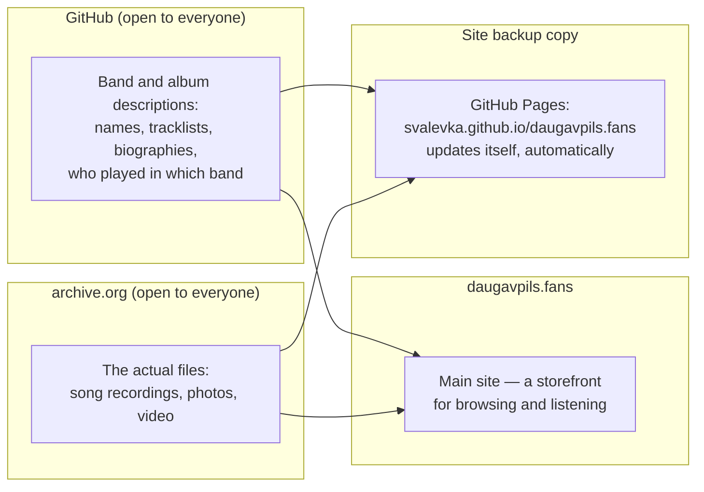

# How this archive works

Archive site: **[daugavpils.fans](https://daugavpils.fans)**

This text isn't for programmers. It's written for anyone interested in
the Daugavpils music scene: listeners, musicians, their friends and
family.

It explains three things in plain language:

1. where the recordings, photos, and all the information about this
   archive actually live;
2. how to add new music, photos, or a band's history;
3. what happens if whoever currently runs this can no longer continue,
   for whatever reason.

Short version: **the daugavpils.fans site is just a storefront.** The
recordings and descriptions themselves live in two places that don't
depend on this site or on any one particular person.

## Where the data actually lives

- **Descriptions** (band names, tracklists, biographies, who played in
  which band) are kept on [GitHub](https://github.com/svalevka/daugavpils.fans)
  — an open, free service for storing text and documents, used by
  millions of people and organizations worldwide. The project's page is
  open to everyone: anyone can visit, view, and download all of its
  content, without permission and without registering. A full copy of
  all descriptions is also automatically saved on archive.org, in one
  permanent, known-in-advance location —
  [archive.org/details/daugavpils-fans-metadata](https://archive.org/details/daugavpils-fans-metadata)
  (for example, M. Spirit's description lives there at
  [.../m-spirit/band.yaml](https://archive.org/download/daugavpils-fans-metadata/m-spirit/band.yaml))
  — so these texts don't depend on GitHub alone, and finding them
  doesn't require guessing anything.
- **The recordings themselves** — songs, photos, video — are stored on
  [archive.org](https://archive.org) (the Internet Archive) — a
  non-profit digital library that has existed since 1996, preserving
  copies of websites, books, music, and video from around the world,
  free and without a time limit. Every band and every album has its own
  page on archive.org, where the files can be downloaded directly.
- **The daugavpils.fans site** is just a convenient way to see and hear
  all of this in one place. It stores nothing of its own: it gathers
  and displays what already lives on GitHub and archive.org.

This split is deliberate: if something happens to the daugavpils.fans
site, the recordings and descriptions themselves don't disappear along
with it — they don't depend on whether the site is running.

## How to add a completely new band or release

If a band or album isn't in the archive yet, it can't currently be
added by yourself through the site — that's still done by hand, by one
of the project's curators. If you have recordings, photos, old tapes,
articles, or simply a story about a Daugavpils band worth preserving,
write to:

- **[GitHub Issues](https://github.com/svalevka/daugavpils.fans/issues)**
  for the project (you can just describe what you have in your own
  words) — or
- **the project curator's email** — the address is in the "How to get
  in touch" section at the end of this page.

You don't need to format anything "properly" yourself — it's enough to
share the material and describe what it is. The curator will then put
it into the archive in the right form.

*(If you know your way around git and want to prepare the material
yourself — the exact technical process is described in
[README.md](README.md).)*

## How to fix text or add photos/video to a band that's already there

This is a different, simpler case. If the band or album is already on
the site, and you want to:

- fix something in the existing text (an inaccuracy in the biography,
  the lineup, a photo caption), or
- add a new photo or video to that band/album,

— **you don't need to file a GitHub Issue and wait for a reply**, and
you don't need to register or use git. Every band or album page has a
**"Suggest a change"** button (it leads to
**[review.daugavpils.fans/submit](https://review.daugavpils.fans/submit)**)
— there you can propose a text correction right away, or upload a new
photo/video straight from your phone or computer.

Both kinds of suggestions are reviewed and approved by the curator the
same way. Once approved, text corrections appear on the site
immediately, automatically. Photos and video are published almost the
same way, but the file first needs to be uploaded to the archive on
archive.org — that's a separate step, so it can take a bit longer.

This feature only exists on the main daugavpils.fans site — the backup
copy on GitHub Pages (see below) doesn't have this form.

## What happens if there's no one left to run this

Honest answer: **the daugavpils.fans address might one day stop
working.** It runs on a server that costs money and needs looking after
(renewing payment, renewing the security certificate, and so on). If
for whatever reason there's no one left to take care of that, this
particular address may eventually disappear.

**But the site itself — the same storefront, with the same content —
already exists today at a backup address** that doesn't depend on this
server, and updates itself automatically every time the archive
changes:

**[svalevka.github.io/daugavpils.fans](https://svalevka.github.io/daugavpils.fans/)**

This copy is hosted on GitHub Pages — a free service for hosting static
sites like this one, from the same GitHub that stores the band and
album descriptions (see above). If daugavpils.fans ever stops working
because of a problem with this particular server, try that address
instead — it should have the same content.

Important caveat: this backup copy is itself hosted on GitHub — the
same service where the band and album descriptions are actually
maintained. It protects against one specific case — the daugavpils.fans
server itself failing — but not against the hypothetical disappearance
of GitHub itself. If that did happen, both copies of the site would go
down along with it, as would the usual way of editing the archive.

**But even that more serious scenario doesn't mean the music and the
bands' history would be lost for good.** Here's why:

- Recordings on archive.org **don't depend on the site or on GitHub**,
  and don't depend on anyone paying for the daugavpils.fans server.
- What's more, archive.org has a separate, consolidated record where a
  copy of the text descriptions of all bands and albums is
  automatically kept (the same content that lives on GitHub) — so even
  the texts, tracklists, and biographies themselves don't depend on
  GitHub alone: they too can be downloaded directly from the archive.org
  page, without GitHub at all.
- Both of these platforms — GitHub and archive.org — are already open
  to everyone right now. Anyone can copy the entire archive for
  themselves, at any time, without asking anyone's permission, because
  the pages are already public.
- Every recording on archive.org is set up so that, alongside the usual
  download, a torrent file is also automatically generated — a way of
  downloading where people who've already downloaded the file can share
  it with each other directly, without a single central server. That
  means that even if something were to happen to archive.org itself
  one day, copies that people have already downloaded keep "living" and
  spreading on their own.

In other words: the site is only a storefront, and it already has a
backup address in case the main one stops working. But what's shown in
that storefront is already sitting out in the open, in two reliable,
independent places — and it's enough for even a handful of people to
have downloaded a copy of the archive for it to never disappear.

## What happens if access to the archive.org account is lost

This is a narrower, separate question from the previous section (which
was about the daugavpils.fans site itself). This one is about the files
themselves: to upload **new** recordings, photos, and video to the
archive, the curator uses one specific archive.org account (its
username is `daugavpils.fans`). If access to that account were lost and
couldn't be recovered — that's unpleasant, but **not the end of the
world**: everything already published stays exactly where it is and
remains accessible to everyone, forever. It would just become harder to
add anything new until access is restored one way or another.

There are two ways to deal with this, and they complement each other:

1. **A pre-arranged, automatic method.** The curator can choose a small
   circle of trusted people in advance. If the curator disappears and
   stops responding, anyone on that list can request access through
   GitHub; the curator then has a week to cancel the request (if they
   in fact haven't disappeared). If nothing happens within that week,
   access is automatically transferred to whoever requested it. This is
   all set up so it doesn't require the curator to keep maintaining
   anything, and doesn't require anyone to store passwords in advance.
   (Technical details in
   [documentation/DEAD_MANS_SWITCH.md](documentation/DEAD_MANS_SWITCH.md),
   for those familiar with git and GitHub Actions.)
2. **A fallback method for anyone.** Even if the first method isn't set
   up, or doesn't work, in principle anyone can restore the ability to
   add new material, even without any prior arrangement — because all
   the band and album descriptions are already open and live on GitHub.
   It takes a few more steps (you need to set up a new archive.org
   account and move the links over to it once), but it doesn't require
   anyone's permission. (Details in
   [documentation/RECOVERY.md](documentation/RECOVERY.md).)

### How to get on the list of trusted people

If you know your way around GitHub and want to be one of the people who
could restore access if the curator were to disappear — it's not a
heavy commitment:

- you need a GitHub account (free, takes a minute to create if you
  don't already have one);
- write to the curator (address in the "How to get in touch" section
  below) and give them your GitHub username;
- nothing else is required of you — nothing to memorize, no passwords
  to store, nothing to periodically confirm. The only thing you might
  ever need to do — and only if the curator actually disappears — is to
  open a request on GitHub once.

## How to download the whole archive for yourself

If you'd like to have your own copy of the entire archive — recordings,
photos, video, and all the descriptions — just in case, or simply to
have it:

You can just listen to the music directly on
[daugavpils.fans](https://daugavpils.fans) — no need to download
anything. But if you specifically want a full copy on your own
computer, there's a ready-made way to download everything with one
command, automatically, with verification that nothing got corrupted
along the way. It takes a bit of technical skill (being able to run a
command in a terminal), but it's one step instead of manually
downloading every band and album one by one.

The full, step-by-step instructions (for those familiar with git and
the terminal): [documentation/BACKUP.md](documentation/BACKUP.md).

## Is this actually allowed? About the license

Yes. Every album in the archive has a Creative Commons license attached
— explicit permission from the recording's author allowing it to be
downloaded and shared further (usually with a condition — non-commercial
use, with attribution). That means recordings from this archive can be
downloaded and shared openly, without asking anyone for additional
permission — the authors themselves already gave it in advance,
specifically so this music wouldn't be lost.

## How to get in touch

- Email: [daugavpils@gmail.com](mailto:daugavpils@gmail.com)
