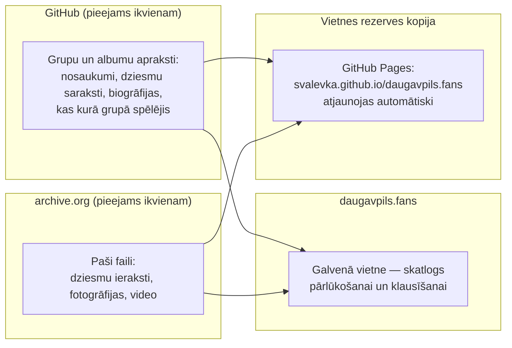

# Kā darbojas šis arhīvs

Arhīva vietne: **[daugavpils.fans](https://daugavpils.fans)**

Šis teksts nav domāts programmētājiem. Tas ir uzrakstīts visiem, kurus interesē
Daugavpils mūzikas skatuve: klausītājiem, mūziķiem, viņu draugiem un tuviniekiem.

Šeit vienkāršā valodā tiek skaidrotas trīs lietas:

1. kur patiesībā glabājas ieraksti, fotogrāfijas un visa informācija par šo arhīvu;
2. kā pievienot jaunu mūziku, fotogrāfijas vai grupas vēsturi;
3. kas notiks, ja tas, kurš pašlaik ar to visu nodarbojas, kāda iemesla dēļ
   vairs nevarēs turpināt.

Īsumā: **vietne daugavpils.fans ir vienkārši skatlogs.** Paši ieraksti un
apraksti glabājas divās vietās, kas nav atkarīgas ne no šīs vietnes, ne no viena
konkrēta cilvēka.

## Kāpēc šis arhīvs pastāv

Daugavpils mūzikas skatuves ieraksti gadiem ilgi pastāvēja izkaisīti — kasetēs,
diskos un atsevišķu cilvēku cietajos diskos, bez vienotas vietas, kur tos varētu
atrast un saglabāt. Šis projekts atrisina tieši šo problēmu: tas saglabā ierakstus,
fotogrāfijas un skatuves vēsturi vienuviet atvērtā veidā, pirms tie ir zuduši
neatgriezeniski.

Šis ir nekomerciāls, brīvprātīgs arhīvs — vietnē nav reklāmu, abonementu vai
monetizācijas, neviens ar to nepelna. Materiālus pievieno skatuves dalībnieki un
klausītāji pēc savas iniciatīvas un labā ticībā — kurators fiziski nespēj sazināties
ar katru grupu un pārbaudīt katru detaļu pirms publicēšanas. Ja esat ieraksta autors
vai pārstāvat grupu un uzskatāt, ka kaut kas publicēts neprecīzi vai bez jūsu piekrišanas —
tas tiek atrisināts ātri un bez konfliktiem, skatiet sadaļu «Vai tā drīkst darīt? Par licenci» zemāk.

Šis ir viena cilvēka brīvprātīgs darbs brīvajā laikā — lūdzu, ņemiet to vērā:
mēs šeit esam, lai saglabātu skatuves mūziku, nevis lai ar kādu strīdētos.

## Kur patiesībā glabājas dati

- **Apraksti** (grupu nosaukumi, dziesmu saraksti, biogrāfijas, dalībnieki)
  tiek uzturēti [GitHub](https://github.com/svalevka/daugavpils.fans)
  — atvērtā, bezmaksas platformā teksta un dokumentu glabāšanai, ko izmanto
  miljoniem cilvēku un organizāciju visā pasaulē. Projekta lapa ir atvērta ikvienam:
  apskatīt un lejupielādēt visu saturu var jebkurš, bez atļaujas un bez reģistrācijas.
  Pilna visu aprakstu kopija tiek automātiski saglabāta arī archive.org, vienā
  pastāvīgā un iepriekš zināmā vietā —
  [archive.org/details/daugavpils-fans-metadata](https://archive.org/details/daugavpils-fans-metadata)
  (piemēram, M. Spirit apraksts tur atrodas adresē
  [.../m-spirit/band.yaml](https://archive.org/download/daugavpils-fans-metadata/m-spirit/band.yaml))
  — tāpēc šie teksti nav atkarīgi tikai no GitHub, un, lai tos atrastu, nekas
  nav jāuzmin.
- **Paši ieraksti** — dziesmas, fotogrāfijas, video — tiek glabāti
  [archive.org](https://archive.org) (Internet Archive) — bezpeļņas
  digitālajā bibliotēkā, kas darbojas kopš 1996. gada un bez maksas un bez laika
  ierobežojuma saglabā tīmekļa vietņu, grāmatu, mūzikas un video kopijas no visas pasaules.
  Katrai grupai un katram albumam archive.org ir sava atsevišķa lapa, no kuras
  failus var lejupielādēt tieši.
- **Vietne daugavpils.fans** ir vienkārši ērts veids, kā to visu apskatīt
  un noklausīties vienuviet. Tā neglabā neko savu: tā apkopo un parāda to,
  kas jau atrodas GitHub un archive.org.

Šāds sadalījums ir veidots apzināti: ja ar vietni daugavpils.fans kaut kas
notiks, paši ieraksti un apraksti nepazudīs — tie nav atkarīgi no tā,
vai vietne darbojas.

## Kā pievienot jaunu grupu vai ierakstu

Pievienot jaunu grupu, albumu, fotogrāfiju vai labojumu var tieši caur vietnes
tīmekļa saskarni — bez nepieciešamības pārzināt git, bez reģistrācijas un bez
speciālas programmatūras.

### 1. Pievienot pilnīgi jaunu grupu
Vietnes [daugavpils.fans](https://daugavpils.fans) galvenajā lapā augšējā izvēlnē
ir poga **«Piedāvāt jaunu grupu»** (ved uz **[review.daugavpils.fans/submit/add-band](https://review.daugavpils.fans/submit/add-band)**).

Tur var norādīt:
- Grupas nosaukumu, darbības gadus un mūzikas žanrus;
- Grupas vēsturi, biogrāfiju vai personīgās atmiņas (liecības);
- Grupas fotogrāfiju (pēc izvēles);
- Pirmo albumu vai demoierakstu (pēc izvēles): nosaukumu, ieraksta gadu,
  skaņdarbu audiofailus (MP3, FLAC, WAV, AAC, OGG, M4A) ar dziesmu secības
  sakārtošanu un vāka noformējumu.

### 2. Pievienot jaunu albumu esošai grupai
Jebkuras grupas lapā ir poga **«Piedāvāt jaunu albumu»** (ved uz albuma
pievienošanas veidlapu konkrētajai grupai, piemēram, `review.daugavpils.fans/submit/<slug>/add-release`).

Tur var:
- Norādīt ieraksta nosaukumu, gadu, žanrus, anotāciju un izvēlēties atvērto licenci (Creative Commons);
- Augšupielādēt dziesmu audiofailus, sakārtot to secību ar vilkšanu un ievadīt nosaukumus;
- Pievienot albuma vāka attēlu.

### 3. Labot tekstu vai pievienot foto/video esošai grupai vai albumam
Jebkuras grupas vai albuma lapā ir poga **«Ieteikt labojumu»** (**[review.daugavpils.fans/submit](https://review.daugavpils.fans/submit)**).
Tur var labot neprecizitātes biogrāfijā, dalībnieku sastāvā, fotogrāfiju parakstos
vai augšupielādēt jaunu fotogrāfiju vai videoklipu / koncerta ierakstu.

### Kas notiek pēc nosūtīšanas?
1. Pieteikumu pārbauda autonoms MI asistents (pārbauda mēstules, manipulācijas,
   vēstures patiesumu un audiofailu derīgumu) vai izskata kuratori moderācijas panelī.
2. Jauna materiāla publicēšanai ir spēkā drošības limiti: ne vairāk kā 1 jauna grupa
   un ne vairāk kā 3 jauni ieraksti 24 stundu laikā (lai aizsargātu arhīvu no mēstuļu pieplūduma).
   Rinda publicējas automātiski, beidzoties 24 stundu logam.
3. Pēc apstiprināšanas automatizētais process GitHub:
   - aprēķina kontrolsummas (SHA-256), bitreitu un dziesmu ilgumu ar `ffprobe`;
   - augšupielādē mediju failus pastāvīgajā glabātuvē archive.org;
   - noformē metadatus projekta repozitorijā un atjaunina metadatu kopsavilkuma rezerves kopiju;
   - no jauna uzbūvē un atjaunina daugavpils.fans vietni.
4. Visi lēmumi (apstiprinātie un noraidītie pieteikumi) tiek fiksēti kuratoru
   lēmumu žurnālā ar vēstures glabāšanu 90 dienas.

### Alternatīva: nodot materiālus kuratoram tieši
Ja tīmekļa veidlapas aizpildīšana nav ērta (piemēram, jums ir kasešu kaste vai daudzi gigabaiti digitalizētu ierakstu):
- ierakstiet projekta **[GitHub Issues](https://github.com/svalevka/daugavpils.fans/issues)** (brīvā formā);
- vai nosūtiet vēstuli **uz kuratora e-pastu** — `daugavpils@gmail.com`.

Kurators palīdzēs digitalizēt, pārbaudīt un rūpīgi iekļaut materiālus arhīvā.

*(Izstrādātājiem un tiem, kas vēlas sagatavot materiālus manuāli git vidē ar pull request palīdzību, soli pa solim process aprakstīts failā [README.md](README.md).)*

## Kas notiks, ja vairs nebūs neviena, kas ar to nodarbojas

Godīga atbilde: **adrese daugavpils.fans kādu dienu var beigt darboties.**
Tā darbojas uz servera, par kuru jāmaksā un par kuru jārūpējas (jāpagarina apmaksa,
jāatjauno drošības sertifikāts un tā tālāk). Ja kāda iemesla dēļ vairs nebūs neviena,
kas par to rūpējas, tieši šī adrese agri vai vēlu var pazust.

**Taču pati vietne — tas ir, šis pats skatlogs ar to pašu saturu — jau tagad
pastāv arī rezerves adresē**, kas nav atkarīga no šī servera un atjaunojas pati,
automātiski, pie katrām arhīva izmaiņām:

**[svalevka.github.io/daugavpils.fans](https://svalevka.github.io/daugavpils.fans/)**

Šī kopija atrodas GitHub Pages — bezmaksas pakalpojumā šādu statisku vietņu uzturēšanai,
ko nodrošina tas pats GitHub, kur glabājas grupu un albumu apraksti (sk. augstāk).
Ja daugavpils.fans kādreiz pārstātu darboties servera problēmu dēļ, izmantojiet šo adresi —
tur jābūt tam pašam saturam.

Svarīga piebilde: šī rezerves kopija pati atrodas GitHub — tajā pašā pakalpojumā,
kur tiek uzturēti grupu un albumu apraksti. Tā pasargā no viena konkrēta gadījuma —
ja atteiktu tieši daugavpils.fans serveris —, bet ne no hipotētiskas paša GitHub pazušanas.
Ja tas tomēr notiktu, reizē pazustu abas vietnes kopijas un ierastā arhīva rediģēšanas iespēja.

**Taču pat tik nopietns scenārijs nenozīmē, ka mūzika un grupu vēsture būtu zudusi neatgriezeniski.**
Lūk, kāpēc:

- Ieraksti vietnē archive.org **nav atkarīgi ne no šīs vietnes, ne no GitHub** un nav
  atkarīgi no tā, vai kāds maksā par daugavpils.fans serveri.
- Turklāt archive.org ir atsevišķs apkopojošs ieraksts, kurā automātiski tiek glabāta
  visu grupu un albumu teksta aprakstu kopija (tas pats saturs, kas atrodas GitHub) —
  tāpēc pat paši teksti, dziesmu saraksti un biogrāfijas nav atkarīgi tikai no GitHub:
  tos var lejupielādēt tieši no archive.org lapas, vispār bez GitHub.
- Abas šīs platformas — GitHub un archive.org — ir atvērtas visiem jau tagad.
  Nokopēt visu arhīvu var jebkurš cilvēks jebkurā brīdī, pat neprasot neviena atļauju —
  jo lapas jau ir publiskas.
- Katrs ieraksts archive.org ir iekārtots tā, ka līdztekus parastajai lejupielādei
  automātiski tiek izveidots arī torrenta fails — lejupielādes veids, kurā cilvēki,
  kas failu jau lejupielādējuši, var dalīties ar to savā starpā tieši, bez viena
  centrālā servera. Tas nozīmē, ka pat tad, ja kādreiz kaut kas notiktu ar pašu archive.org,
  kopijas, kuras kāds jau ir lejupielādējis, turpinās pastāvēt un izplatīties pašas par sevi.

Citiem vārdiem: vietne ir tikai skatlogs, un tai jau ir rezerves adrese gadījumam,
ja galvenā pārstāj darboties. Bet tas, kas šajā skatlogā tiek rādīts, jau tagad
atklāti atrodas divās drošās, neatkarīgās vietās, un pietiek ar to, ka kaut daži
cilvēki būs lejupielādējuši arhīva kopiju — un tas nepazudīs nekad.

## Kas notiks, ja tiks zaudēta piekļuve archive.org kontam

Šis ir atsevišķs, šaurāks jautājums nekā iepriekšējā sadaļa (kur bija runa par
pašu daugavpils.fans vietni). Šeit runa ir par pašiem failiem: lai arhīvā augšupielādētu
**jaunus** ierakstus, foto un video, kurators izmanto vienu konkrētu archive.org kontu
(tā lietotājvārds ir `daugavpils.fans`). Ja piekļuve šim kontam tiktu zaudēta un to
neizdotos atgūt — tas ir nepatīkami, bet **nav pasaules gals**: viss, kas jau publicēts,
paliek tieši tur, kur ir, un paliek pieejams visiem uz visiem laikiem. Vienkārši
kļūs grūtāk pievienot kaut ko jaunu, kamēr piekļuve tādā vai citādā veidā netiks atjaunota.

Ir divi veidi, kā ar to tikt galā, un tie viens otru papildina:

1. **Iepriekš sagatavots automātisks veids.** Kurators var iepriekš izvēlēties
   nelielu uzticamu personu loku. Ja kurators pazūd un neatbild, jebkurš no šī saraksta
   var pieprasīt piekļuvi caur GitHub; pēc tam kuratoram ir viena nedēļa, lai
   pieprasījumu atceltu (ja viņš patiesībā nekur nav pazudis). Ja nedēļas laikā
   nekas nenotiek, piekļuve automātiski pāriet pieprasītājam. Tas viss ir iekārtots tā,
   ka neprasa no kuratora pastāvīgu uzturēšanu un neprasa no citiem iepriekš glabāt
   paroles. (Tehniskās detaļas failā
   [documentation/DEAD_MANS_SWITCH.md](documentation/DEAD_MANS_SWITCH.md)
   tiem, kas pārzina git un GitHub Actions.)
2. **Rezerves veids ikvienam.** Pat ja pirmais veids nav iestatīts vai nenostrādā,
   atjaunot iespēju pievienot jaunu saturu principā var jebkurš, pat bez iepriekšējas
   vienošanās — jo visi grupu un albumu apraksti jau ir atvērti un atrodas GitHub.
   Tas prasa nedaudz vairāk soļu (jāizveido jauns konts archive.org un vienreiz
   jāpārvieto saites), taču neprasa neviena atļauju. (Sīkāk —
   [documentation/RECOVERY.md](documentation/RECOVERY.md).)

### Kā iekļūt uzticamo personu sarakstā

Ja pārzināt GitHub un vēlaties būt viens no tiem, kas varētu atjaunot piekļuvi,
ja kurators pēkšņi pazustu — tas nav apgrūtinošs pienākums:

- nepieciešams GitHub konts (bezmaksas, izveidojams minūtes laikā, ja tāda vēl nav);
- uzrakstiet kuratoram (adrese sadaļā «Kā sazināties» zemāk) un norādiet savu GitHub lietotājvārdu;
- tālāk no jums nekas netiek prasīts — nav nekas jāiegaumē, nav jāglabā paroles vai
  periodiski kaut kas jāapstiprina. Vienīgais, ko varētu nākties darīt — un tikai tad,
  ja kurators patiešām pazustu —, ir vienu reizi atvērt pieteikumu GitHub.

## Kā pašam lejupielādēt visu arhīvu

Ja vēlaties iegūt personīgu visa arhīva kopiju — ierakstus, foto, video un visus
aprakstus — drošības labad vai vienkārši, lai tā būtu:

Vienkārši klausīties mūziku var tieši vietnē [daugavpils.fans](https://daugavpils.fans)
— nekas nav jālejupielādē. Bet, ja nepieciešama tieši pilna kopija savā datorā —
ir gatavs veids, kā lejupielādēt visu ar vienu komandu, automātiski un ar pārbaudi,
ka lejupielādes laikā nekas nav bojāts. Tas prasa nelielas tehniskās iemaņas
(prasmi palaist komandu terminālī), taču prasa vienu soli tā vietā, lai manuāli
lejupielādētu katru grupu un albumu atsevišķi.

Pilna pamācība soli pa solim (tiem, kas pārzina git un termināli):
[documentation/BACKUP.md](documentation/BACKUP.md).

## Vai tā drīkst darīt? Par licenci

Katram albumam arhīvā ir norādīta Creative Commons licence — to izvēlas tas,
kurš albumu pievieno arhīvam (pats autors, cits grupas dalībnieks vai kāds no viņu
vides), kā labticīgu paziņojumu par to, ka ierakstu drīkst brīvi izplatīt
(parasti ar nosacījumu — nekomerciāliem mērķiem un norādot autorību). Arhīva kurators
personīgi nepārbauda katru šādu paziņojumu ar pašu grupu pirms publicēšanas —
tas nav iespējams arhīvam, kas tiek papildināts ar kopienas spēkiem. Ja esat autors
un uzskatāt, ka licence norādīta nepareizi vai neesat devis šādu piekrišanu —
lasiet zemāk, kā rīkoties.

### Ja esat autors un vēlaties dzēst savu ierakstu

Mēs cienām autora tiesības lemt par savas mūzikas likteni. Ja esat ieraksta autors
(vai tiesību īpašnieks) un vēlaties, lai tas tiktu izņemts no arhīva — uzrakstiet mums,
un mēs reaģēsim ātri. Pirms izņemšanas mēs varam lūgt apstiprināt autorību — tas
aizsargā arhīvu no nejaušiem vai negodprātīgiem pieprasījumiem no nepiederošām personām,
kas nekādi nav saistītas ar ierakstu. Līdz apstiprināšanai ieraksts var tikt
īslaicīgi paslēpts no vietnes, taču netiek dzēsts neatgriezeniski — ja iesniegums
izrādīsies kļūdains, viss tiek atjaunots bez zudumiem.

## Kā sazināties

- E-pasts: [daugavpils@gmail.com](mailto:daugavpils@gmail.com)
