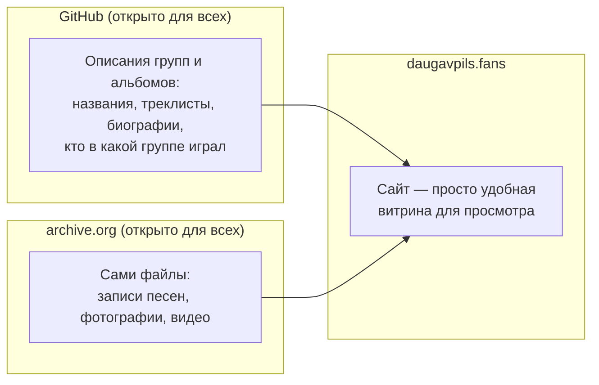
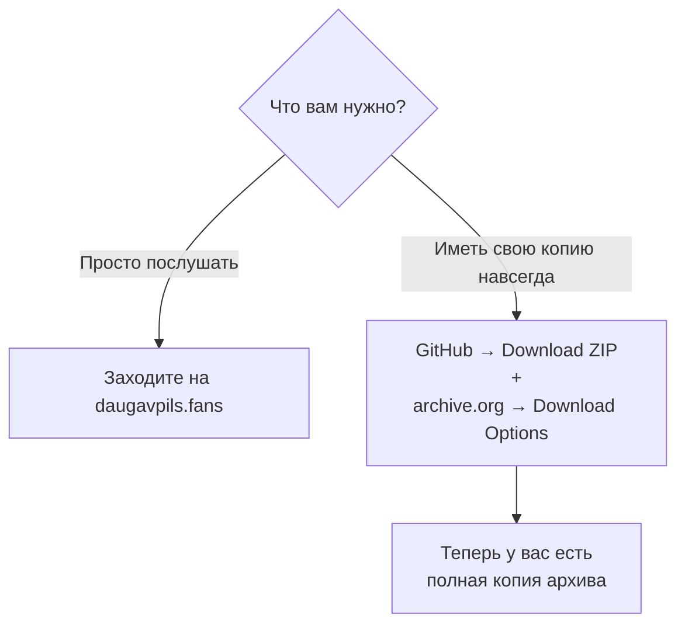

# Как устроен этот архив

Сайт архива: **[daugavpils.fans](https://daugavpils.fans)**

Этот текст — не для программистов. Он написан для всех, кому интересна
музыка Даугавпилсской сцены: слушателей, музыкантов, их друзей и близких.

Здесь простыми словами объясняется три вещи:

1. где на самом деле хранятся записи, фото и вся информация об этом архиве;
2. как добавить новую музыку, фотографии или историю группы;
3. что произойдёт, если тот, кто сейчас всем этим занимается, по
   какой-то причине не сможет продолжать.

Коротко: **сайт daugavpils.fans — это просто витрина.** Сами записи и
описания хранятся в двух местах, независимых от этого сайта и от одного
конкретного человека.

## Где на самом деле хранятся данные

- **Описания** (названия групп, треклисты, биографии, кто в какой группе
  играл) ведутся на [GitHub](https://github.com/svalevka/daugavpils.fans)
  — это открытый, бесплатный сервис для хранения текста и документов,
  которым пользуются миллионы людей и организаций по всему миру. Страница
  проекта открыта для всех: зайти, посмотреть и скачать всё содержимое
  может кто угодно, без разрешения и без регистрации. Полная копия всех
  описаний также автоматически сохраняется на archive.org, в одном
  постоянном, заранее известном месте —
  [archive.org/details/daugavpils-fans-metadata](https://archive.org/details/daugavpils-fans-metadata)
  (например, описание M. Spirit лежит там по адресу
  [.../m-spirit/band.yaml](https://archive.org/download/daugavpils-fans-metadata/m-spirit/band.yaml))
  — так что эти тексты не зависят только от GitHub, и чтобы их найти, не
  нужно ничего угадывать.
- **Сами записи** — песни, фотографии, видео — хранятся на
  [archive.org](https://archive.org) (Internet Archive) — это
  некоммерческая цифровая библиотека, существующая с 1996 года и хранящая
  копии сайтов, книг, музыки и видео со всего мира бесплатно и без ограничения
  по времени. У каждой группы и у каждого альбома есть своя отдельная
  страница на archive.org, откуда файлы можно скачать напрямую.
- **Сайт daugavpils.fans** — это просто удобный способ всё это посмотреть
  и послушать в одном месте. Он не хранит ничего своего: он собирает и
  показывает то, что лежит на GitHub и archive.org.

Такое разделение сделано специально: если с сайтом daugavpils.fans
что-то случится, сами записи и описания от этого никуда не исчезнут — они
не зависят от того, работает сайт или нет.

## Как добавить новую музыку, фото или историю

Если у вас есть записи, фотографии, старые кассеты, статьи или просто
история о даугавпилсской группе, которую стоит сохранить — самый простой
способ:

- **написать в [Issues на GitHub](https://github.com/svalevka/daugavpils.fans/issues)**
  проекта (можно просто в свободной форме описать, что у вас есть);
- **написать в WhatsApp-группе проекта**, если вы уже в ней состоите.

Не нужно самим ничего оформлять "по правилам" — достаточно поделиться
материалами и рассказать, что это такое. Дальше кто-то оформит это в
архив в правильном виде.

*(Если вы разбираетесь в git и хотите оформить материалы сами — точный
технический процесс описан в [README.md](README.md).)*

## Что будет, если этим станет некому заниматься

Честный ответ: **адрес daugavpils.fans может однажды перестать
открываться.** Он работает на сервере, за который нужно платить и о
котором нужно заботиться (продлевать оплату, обновлять сертификат
безопасности и так далее). Если по какой-то причине этим больше некому
будет заниматься, именно этот адрес рано или поздно может исчезнуть.

**Но сам сайт — то есть эта же витрина, с тем же содержимым — уже
сейчас существует и по запасному адресу**, который не зависит от этого
сервера и обновляется сам, автоматически, при каждом изменении архива:

**[svalevka.github.io/daugavpils.fans](https://svalevka.github.io/daugavpils.fans/)**

Эта копия размещена на GitHub Pages — бесплатном сервисе для размещения
таких статичных сайтов, от того же GitHub, где хранятся описания групп
и альбомов (см. выше). Если daugavpils.fans когда-то перестанет
открываться из-за проблем именно с этим сервером, попробуйте этот
адрес — там должно быть то же самое.

Важная оговорка: эта резервная копия сама размещена на GitHub — том же
сервисе, где ведётся сама работа над описаниями групп и альбомов. Она
защищает от одного конкретного случая — если откажет именно сервер
daugavpils.fans — но не от гипотетического исчезновения самого GitHub.
Если бы это всё-таки произошло, вместе с ним пропали бы обе копии
сайта и сама возможность редактировать архив привычным способом.

**Но даже такой, более серьёзный сценарий не означает, что музыка и
история группы будут потеряны безвозвратно.** Вот почему:

- Записи на archive.org **не зависят ни от сайта, ни от GitHub** и не
  зависят от того, платит ли кто-то за сервер daugavpils.fans.
- Более того, на archive.org есть отдельная сводная запись, где
  автоматически хранится копия текстовых описаний всех групп и
  альбомов (то же самое, что лежит на GitHub) — так что даже сами
  тексты, треклисты и биографии не зависят только от GitHub: их тоже
  можно скачать прямо со страницы archive.org, без GitHub вообще.
- Обе эти площадки — GitHub и archive.org — открыты для всех уже сейчас.
  Скопировать себе весь архив может любой человек, в любой момент, даже
  ни у кого не спрашивая разрешения — потому что страницы уже публичные.
- Каждая запись на archive.org устроена так, что помимо обычного
  скачивания у неё автоматически появляется ещё и торрент-файл — способ
  скачивания, при котором люди, уже скачавшие файл, могут делиться им
  друг с другом напрямую, без единого центрального сервера. Это значит,
  что даже если однажды что-то случится с самим archive.org, копии,
  которые уже кто-то скачал, продолжат "жить" и распространяться дальше
  сами по себе.

Иными словами: сайт — это только витрина, и у неё уже есть запасной
адрес на случай, если основной перестанет работать. Но то, что в этой
витрине показано, уже сейчас лежит открыто в двух надёжных, независимых
местах, и достаточно, чтобы хотя бы несколько человек скачали себе
копию архива — и он не исчезнет никогда.

## Как самому скачать себе весь архив

Шаг за шагом, если вы хотите иметь свою собственную копию — на всякий
случай, или просто чтобы она у вас была:

1. **Описания групп и альбомов** — откройте
   [github.com/svalevka/daugavpils.fans](https://github.com/svalevka/daugavpils.fans),
   нажмите зелёную кнопку **"Code"**, затем **"Download ZIP"**. Скачается
   архив со всеми текстами, треклистами и биографиями.
2. **Сами записи, фото и видео** — искать ничего не нужно и никакую ссылку
   строить самому не надо: на сайте [daugavpils.fans](https://daugavpils.fans)
   на странице каждой группы и каждого альбома уже стоит прямая ссылка на
   archive.org — просто откройте страницу нужной группы/альбома на сайте и
   перейдите по ней.

   На странице каждой группы/альбома на archive.org есть кнопка
   **"Download Options"** — там можно скачать как отдельные файлы, так и
   всё сразу одним архивом или торрентом.

   *(Технические подробности, только для тех, кто разбирается в git: та же
   ссылка на archive.org — вместе с отдельной ссылкой на торрент — записана
   и в самих текстовых файлах метаданных, `band.yaml`/`release.yaml`, в
   поле `sameAs`, рядом с описанием этой группы/альбома. Это не формула,
   которую нужно применять самому, а уже готовая, реальная ссылка.)*

## А можно так делать? Про лицензию

Да. У каждого альбома в архиве указана лицензия Creative Commons — это
разрешение от автора записи, явно позволяющее скачивать её и делиться ею
дальше (обычно с условием — не в коммерческих целях и с указанием
авторства). Это значит, что скачивать и распространять записи из этого
архива можно открыто, не спрашивая ни у кого дополнительного
разрешения — сами авторы уже дали его заранее, именно для того, чтобы эта
музыка не потерялась.

## Как связаться

- [Issues на GitHub](https://github.com/svalevka/daugavpils.fans/issues) — открыто для всех, не требует личного знакомства
- WhatsApp-группа проекта — для тех, кто уже в ней состоит  