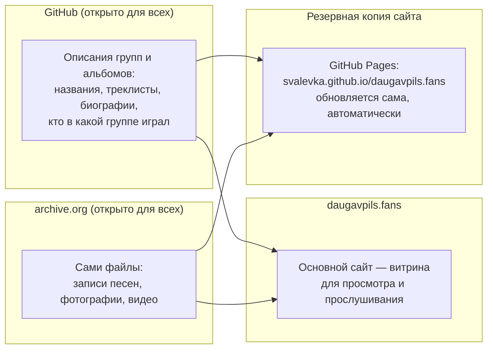

# Как устроен этот архив

Сайт архива: **[daugavpils.fans](https://daugavpils.fans)**

Этот текст — не для программистов. Он написан для всех, кому интересна
музыка Даугавпилсской сцены: слушателей, музыкантов, их друзей и близких.

Здесь простыми словами объясняется три вещи:

1. где на самом деле хранятся записи, фото и вся информация об этом архиве;
2. как добавить новую музыку, фотографии или историю группы;
3. что произойдёт, если тот, кто сейчас всем этим занимается, по
   какой-то причине не сможет продолжать.

Коротко: **сайт daugavpils.fans — это просто витрина.** Сами записи и
описания хранятся в двух местах, независимых от этого сайта и от одного
конкретного человека.

## Где на самом деле хранятся данные

- **Описания** (названия групп, треклисты, биографии, кто в какой группе
  играл) ведутся на [GitHub](https://github.com/svalevka/daugavpils.fans)
  — это открытый, бесплатный сервис для хранения текста и документов,
  которым пользуются миллионы людей и организаций по всему миру. Страница
  проекта открыта для всех: зайти, посмотреть и скачать всё содержимое
  может кто угодно, без разрешения и без регистрации. Полная копия всех
  описаний также автоматически сохраняется на archive.org, в одном
  постоянном, заранее известном месте —
  [archive.org/details/daugavpils-fans-metadata](https://archive.org/details/daugavpils-fans-metadata)
  (например, описание M. Spirit лежит там по адресу
  [.../m-spirit/band.yaml](https://archive.org/download/daugavpils-fans-metadata/m-spirit/band.yaml))
  — так что эти тексты не зависят только от GitHub, и чтобы их найти, не
  нужно ничего угадывать.
- **Сами записи** — песни, фотографии, видео — хранятся на
  [archive.org](https://archive.org) (Internet Archive) — это
  некоммерческая цифровая библиотека, существующая с 1996 года и хранящая
  копии сайтов, книг, музыки и видео со всего мира бесплатно и без ограничения
  по времени. У каждой группы и у каждого альбома есть своя отдельная
  страница на archive.org, откуда файлы можно скачать напрямую.
- **Сайт daugavpils.fans** — это просто удобный способ всё это посмотреть
  и послушать в одном месте. Он не хранит ничего своего: он собирает и
  показывает то, что лежит на GitHub и archive.org.

Такое разделение сделано специально: если с сайтом daugavpils.fans
что-то случится, сами записи и описания от этого никуда не исчезнут — они
не зависят от того, работает сайт или нет.

## Как добавить новую группу или релиз

Добавить новую группу, альбом, фото или исправление можно прямо через веб-интерфейс сайта — без необходимости знать git, без регистрации и без специальных программ.

### 1. Добавить совершенно новую группу
На главной странице сайта [daugavpils.fans](https://daugavpils.fans) в верхней шапке есть кнопка **«Предложить группу»** (ведёт на **[review.daugavpils.fans/submit/add-band](https://review.daugavpils.fans/submit/add-band)**).

Там можно указать:
- Название группы, годы активности и музыкальные жанры;
- Историю группы, биографию или личные воспоминания (свидетельства очевидцев);
- Фотографию группы (по желанию);
- Первый альбом или демо-запись (по желанию): название, год записи, аудиофайлы треков (MP3, FLAC, WAV, AAC, OGG, M4A) с расстановкой треков по порядку и обложкой.

### 2. Добавить новый альбом к уже существующей группе
На странице любой группы есть кнопка **«Предложить альбом»** (ведёт на форму добавления альбома к этой группе, например `review.daugavpils.fans/submit/<slug>/add-release`).

Там можно:
- Указать название релиза, год, жанры, аннотацию и выбрать открытую лицензию (Creative Commons);
- Загрузить аудиофайлы песен, расставить их порядок перетаскиванием и ввести названия треков;
- Прикрепить файл обложки.

### 3. Исправить текст или добавить фото/видео к существующей группе/альбому
На странице любой группы или альбома есть кнопка **«Предложить изменение»** (**[review.daugavpils.fans/submit](https://review.daugavpils.fans/submit)**). Там можно поправить неточности в биографии, составе участников, подписях к фото или загрузить новую фотографию или видеоклип/концертную запись.

### Что происходит после отправки?
1. Заявку проверяет автономный ИИ-ассистент (проверяет на спам, манипуляции, подлинность истории и валидность аудиозаписей) либо просматривают кураторы в панели модерации.
2. Для публикации новых материалов действуют защитные лимиты: публикуется не более 1 новой группы и не более 3 новых релизов в течение 24 часов (чтобы защитить архив от наплыва спама). Очередь публикуется автоматически по мере истечения 24-часового окна.
3. После одобрения автоматический процесс на GitHub сам:
   - рассчитывает контрольные суммы (SHA-256), битрейт и длительность треков через `ffprobe`;
   - загружает медиафайлы в постоянное хранилище на archive.org;
   - оформляет метаданные в репозитории проекта и обновляет резервную копию метаданных;
   - пересобирает и обновляет сайт daugavpils.fans.

### Альтернатива: передать материалы куратору напрямую
Если вам неудобно заполнять веб-форму (например, у вас коробка кассет или много гигабайт оцифровок):
- напишите **в [Issues на GitHub](https://github.com/svalevka/daugavpils.fans/issues)** проекта (в свободной форме);
- или отправьте письмо **на email куратора** — `daugavpils@gmail.com`.

Куратор поможет оцифровать, проверить и бережно включить материалы в архив.

*(Для разработчиков и тех, кто хочет оформить материалы вручную в git через pull request, пошаговый технический процесс описан в [README.md](README.md).)*

## Что будет, если этим станет некому заниматься

Честный ответ: **адрес daugavpils.fans может однажды перестать
открываться.** Он работает на сервере, за который нужно платить и о
котором нужно заботиться (продлевать оплату, обновлять сертификат
безопасности и так далее). Если по какой-то причине этим больше некому
будет заниматься, именно этот адрес рано или поздно может исчезнуть.

**Но сам сайт — то есть эта же витрина, с тем же содержимым — уже
сейчас существует и по запасному адресу**, который не зависит от этого
сервера и обновляется сам, автоматически, при каждом изменении архива:

**[svalevka.github.io/daugavpils.fans](https://svalevka.github.io/daugavpils.fans/)**

Эта копия размещена на GitHub Pages — бесплатном сервисе для размещения
таких статичных сайтов, от того же GitHub, где хранятся описания групп
и альбомов (см. выше). Если daugavpils.fans когда-то перестанет
открываться из-за проблем именно с этим сервером, попробуйте этот
адрес — там должно быть то же самое.

Важная оговорка: эта резервная копия сама размещена на GitHub — том же
сервисе, где ведётся сама работа над описаниями групп и альбомов. Она
защищает от одного конкретного случая — если откажет именно сервер
daugavpils.fans — но не от гипотетического исчезновения самого GitHub.
Если бы это всё-таки произошло, вместе с ним пропали бы обе копии
сайта и сама возможность редактировать архив привычным способом.

**Но даже такой, более серьёзный сценарий не означает, что музыка и
история группы будут потеряны безвозвратно.** Вот почему:

- Записи на archive.org **не зависят ни от сайта, ни от GitHub** и не
  зависят от того, платит ли кто-то за сервер daugavpils.fans.
- Более того, на archive.org есть отдельная сводная запись, где
  автоматически хранится копия текстовых описаний всех групп и
  альбомов (то же самое, что лежит на GitHub) — так что даже сами
  тексты, треклисты и биографии не зависят только от GitHub: их тоже
  можно скачать прямо со страницы archive.org, без GitHub вообще.
- Обе эти площадки — GitHub и archive.org — открыты для всех уже сейчас.
  Скопировать себе весь архив может любой человек, в любой момент, даже
  ни у кого не спрашивая разрешения — потому что страницы уже публичные.
- Каждая запись на archive.org устроена так, что помимо обычного
  скачивания у неё автоматически появляется ещё и торрент-файл — способ
  скачивания, при котором люди, уже скачавшие файл, могут делиться им
  друг с другом напрямую, без единого центрального сервера. Это значит,
  что даже если однажды что-то случится с самим archive.org, копии,
  которые уже кто-то скачал, продолжат "жить" и распространяться дальше
  сами по себе.

Иными словами: сайт — это только витрина, и у неё уже есть запасной
адрес на случай, если основной перестанет работать. Но то, что в этой
витрине показано, уже сейчас лежит открыто в двух надёжных, независимых
местах, и достаточно, чтобы хотя бы несколько человек скачали себе
копию архива — и он не исчезнет никогда.

## Что будет, если пропадёт доступ к аккаунту на archive.org

Это отдельный, более узкий вопрос, чем предыдущий раздел (там речь о
самом сайте daugavpils.fans). Здесь — про сами файлы: чтобы загружать в
архив **новые** записи, фото и видео, куратор использует один
конкретный аккаунт на archive.org (его имя — `daugavpils.fans`). Если
доступ к этому аккаунту будет потерян и его не удастся восстановить —
это неприятно, но **не конец света**: всё, что уже опубликовано,
никуда не денется и останется доступно всем, как есть, навсегда. Просто
станет сложнее добавлять что-то новое, пока доступ так или иначе не
восстановят.

Есть два способа справиться с этим, и они дополняют друг друга:

1. **Заранее подготовленный автоматический способ.** Куратор может
   заранее выбрать небольшой круг доверенных людей. Если куратор
   пропадёт и не будет отвечать, любой из этого списка может запросить
   доступ через GitHub; после этого у куратора есть неделя, чтобы
   отменить запрос (если он на самом деле никуда не пропал). Если за
   неделю ничего не произошло, доступ автоматически передаётся тому,
   кто запросил. Всё это устроено так, что не требует от куратора
   постоянно что-то поддерживать, и не требует ни от кого хранить
   пароли заранее. (Технические подробности — в
   [documentation/DEAD_MANS_SWITCH.md](documentation/DEAD_MANS_SWITCH.md),
   для тех, кто разбирается в git и GitHub Actions.)
2. **Запасной способ для любого человека.** Даже если первый способ не
   настроен или не сработал, восстановить возможность добавлять новое
   может в принципе кто угодно, даже без всякой предварительной
   договорённости — потому что все описания групп и альбомов и так
   открыты и лежат на GitHub. Это займёт немного больше шагов (нужно
   завести новый аккаунт на archive.org и один раз перенести туда
   ссылки), но не требует ничьего разрешения. (Подробности —
   [documentation/RECOVERY.md](documentation/RECOVERY.md).)

### Как попасть в список доверенных людей

Если вы разбираетесь в GitHub и хотите быть одним из тех, кто сможет
восстановить доступ, если куратор вдруг пропадёт — это не тяжёлая
обязанность:

- нужен аккаунт на GitHub (бесплатный, завести можно за минуту, если
  его ещё нет);
- напишите куратору (адрес — в разделе «Как связаться» ниже) и
  укажите своё имя пользователя на GitHub;
- дальше от вас ничего не требуется — не нужно ничего запоминать,
  хранить пароли или периодически что-то подтверждать. Единственное,
  что может понадобиться сделать — и то только если куратор
  действительно пропадёт, — это один раз открыть заявку на GitHub.

## Как самому скачать себе весь архив

Если хочется иметь свою собственную копию всего архива — записей, фото,
видео и всех описаний — на всякий случай, или просто чтобы она была:

Просто послушать музыку можно прямо на [daugavpils.fans](https://daugavpils.fans)
— скачивать ничего не нужно. А если нужна именно полная копия себе на
компьютер — есть готовый способ скачать всё одной командой, автоматически
и с проверкой, что ничего не повреждено при скачивании. Он требует
немного технических навыков (умения запустить команду в терминале), зато
занимает один шаг вместо ручного скачивания каждой группы и альбома по
отдельности.

Полная, пошаговая инструкция (для тех, кто разбирается в git и терминале):
[documentation/BACKUP.md](documentation/BACKUP.md).

## А можно так делать? Про лицензию

Да. У каждого альбома в архиве указана лицензия Creative Commons — это
разрешение от автора записи, явно позволяющее скачивать её и делиться ею
дальше (обычно с условием — не в коммерческих целях и с указанием
авторства). Это значит, что скачивать и распространять записи из этого
архива можно открыто, не спрашивая ни у кого дополнительного
разрешения — сами авторы уже дали его заранее, именно для того, чтобы эта
музыка не потерялась.

## Как связаться

- Email: [daugavpils@gmail.com](mailto:daugavpils@gmail.com)  