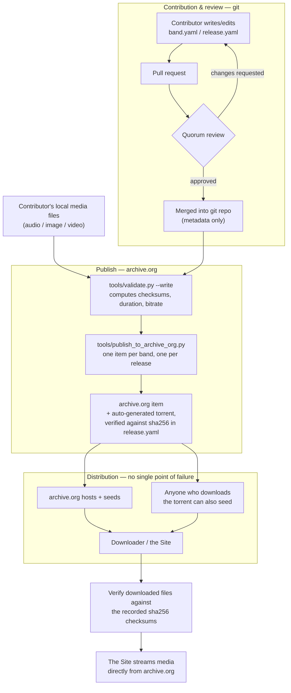

# Daugavpils Music Archive

Website: **[daugavpils.fans](https://daugavpils.fans)**

Music from the Daugavpils (Latvia) music scene is scattered across
individual people's hard drives, cassettes, and memories, with no shared,
durable place to keep it.

This project solves the actual bottleneck first: a portable archive of
plain audio/image/video files plus schema-validated metadata, organized
by a documented folder convention, checksummed for integrity — reusable
by anyone, in any language, independent of any single website, hosting
arrangement, or maintainer.

## How this works, at a glance

The two layers stay separate all the way through: git carries the small,
reviewable **metadata**; archive.org carries the actual **media**. Nothing
about "how do people get the music" depends on this GitHub repo staying
online, or on any one person's hosting bill.



In words: someone contributes a band's recordings by opening a pull
request against this repo with just the metadata (the actual files stay
local); the quorum reviews and merges it; `tools/publish_to_archive_org.py`
publishes that band/release's media as its own archive.org item, using
the checksums already sitting in each `release.yaml` to know exactly what
should be there. Each item is a complete, working copy of that
band/release's media on its own — it needs no dependency on GitHub, or
this repo, or anyone's hosting still being alive to be useful — and
archive.org auto-generates a torrent for it, so anyone who downloads it
can also seed it. Anyone downloading a copy can verify it's intact,
independent of who they got it from. The Site (see `webapp/`) is a
consumer of that same archive.org-hosted data, streaming media directly
from it rather than hosting its own copy — not a dependency of the
archive existing in the first place.

## What's actually portable here

The **archive** is `bands/` (audio/image/video files + YAML metadata)
plus `schema/` (the JSON Schema files describing what valid metadata
looks like). Those are plain text and media files — no database, no
server, no proprietary format. Anyone, in any language, can read and
validate them without this repo's Python tooling.

**Only the metadata is version-controlled, right now.** Audio/image/video
files live under `bands/` locally (`tools/validate.py` reads and
checksums them there) but are excluded from git (see `.gitignore`) — per
the model above, they're meant to reach people via archive.org, not by
committing binaries into this repository's history.

**The git-tracked metadata is the contract an archive.org item must
satisfy.** Each `release.yaml`/`band.yaml` declares exactly which files
must exist (`contentUrl`) and what their exact byte-content must be
(`sha256`, under `identifier`). `tools/validate.py` enforces that
contract locally — checking that every file the metadata claims exists,
with the checksum it claims — and `tools/publish_to_archive_org.py`
refuses to publish over a tree that hasn't already passed `validate.py`,
so every archive.org item inherits that guarantee by construction.

The **tooling** (`tools/`, Python + Pydantic) is a convenience layer for
*this* maintainer: it validates metadata against the schema and computes
checksums/audio properties. It is not part of the contract. `schema/*.schema.json`
is generated from `tools/models.py` — if you want to validate this archive
from Go, Node, or anything else, validate against those JSON Schema files
directly; you don't need Python.

**`webapp/` is one opinionated way to present this data, not the only
one.** It's a Jinja2/static-HTML site (see ADR-0001) reflecting this
maintainer's choices about routes, layout, and language handling. Because
the archive underneath it is just schema-validated YAML + files on
archive.org, anyone could build a different website, app, or tool against
the same data without needing `webapp/`'s code or agreeing with its
choices - `webapp/` is a consumer of the archive, not a definition of it.

## Layout

```
bands/
  <band-slug>/
    band.yaml                  # MusicGroup metadata
    media/                     # band-level photos/videos/posters, not tied
      band-photo.jpg           # to any one release (kept locally; gitignored,
      concert-poster.webp      # not committed)
      ...
    <release-slug>/
      release.yaml              # MusicAlbum metadata
      01-track-slug.mp3          # audio files, as originally sourced
      03-track-slug.mp3          # (kept locally; gitignored, not committed)
      ...
schema/
  band.schema.json              # JSON Schema for band.yaml (generated)
  release.schema.json           # JSON Schema for release.yaml (generated)
tools/
  models.py                     # Pydantic models (source of the schema)
  export_schema.py              # regenerates schema/*.schema.json
  validate.py                   # validates bands/ against the schema
  archive_org.py                # archive.org item-id/URL conventions
  publish_to_archive_org.py     # publishes bands/**/*.yaml's media to archive.org
docs/agents/                    # config consumed by AI coding-agent skills
                                 # (issue tracker, triage labels, domain docs)
                                 # - not part of the archive itself
webapp/                          # public website built from the archive (ADR-0001)
  build.py                       # renders bands/**/*.yaml into static HTML,
                                  # linking media straight to archive.org
  templates/, static/            # Jinja2 templates, CSS
  deploy/                        # docker-compose + nginx config run on the host
  dist/                          # generated output: HTML/CSS only, no media
                                  # (gitignored, not committed)
.github/workflows/pages.yml      # builds + deploys the GitHub Pages mirror
                                  # on every push to main (ADR-0002)
```

### Naming convention

Folder and file names are **slugs**: short, plain-ASCII, URL-safe
versions of a name — lowercase, hyphens instead of spaces, no accents or
punctuation (e.g. band name `M. Spirit` → folder name `m-spirit`). Where
the real name is written in a non-Latin **script** (script = writing
system/alphabet — Cyrillic, Greek, Arabic, etc.; most of these bands'
names and song titles are in Cyrillic), the slug is a transliteration of
it into Latin letters. This keeps the archive safe for git, URLs,
filesystems, and torrent clients regardless of locale.

The real name, in its real script, is never lost — it's always preserved
in the metadata (`name`, and `alternateName` for other known spellings or
titles), never only encoded in the filename.

### Audio files

Files are kept in their original format and quality — **no forced
transcoding**. If a source is a 1995 cassette digitized to MP3 320kbps,
that's what's archived; the metadata records the true format
(`encodingFormat`, `bitrate`) rather than pretending it's something it
isn't. If a better-quality source ever surfaces, it gets added as
metadata evolves — files are never silently overwritten.

### Metadata schema

Metadata is authored as hand-editable YAML, aligned to
[schema.org](https://schema.org) vocabulary (`MusicGroup`, `MusicAlbum`,
`MusicRecording`, `AudioObject`, `ImageObject`, `VideoObject`), so it's
meaningful outside this project too (e.g. embeddable as JSON-LD on a
future website, for search engines). A couple of fields have no
schema.org equivalent and are handled with a documented convention rather
than an invented field name:

- **Checksums** use schema.org's generic `identifier` / `PropertyValue`
  pattern: `{"@type": "PropertyValue", "propertyID": "sha256", "value": "..."}`.
- **`sameAs`** (on both `MusicGroup` and `MusicAlbum`) holds external
  reference URLs. Some are hand-authored (a last.fm/Bandcamp page cited
  as a source); others - each item's archive.org details-page and
  torrent URL - are written automatically by
  `tools/publish_to_archive_org.py` right after a successful publish,
  the same "compute once, record it" pattern used for checksums (see
  `tools/TOOLS.md`). Never hand-type an archive.org/torrent URL into
  `sameAs`; let the publish tool record it.
- **The metadata itself is backed up to archive.org, not just GitHub.**
  As a final step, `tools/publish_to_archive_org.py` uploads every
  `band.yaml`/`release.yaml` into one dedicated item -
  [`daugavpils-fans-metadata`](https://archive.org/details/daugavpils-fans-metadata)
  - each at its path relative to `bands/`, e.g.
  https://archive.org/download/daugavpils-fans-metadata/m-spirit/band.yaml.
  One documented, guessable location for the whole Archive's metadata, not
  a copy scattered across every band/release's own item (which would mean
  already knowing every band/release's item id just to reassemble it -
  not actually recoverable-from-scratch). Re-published on every metadata
  edit, same as a changed media file would be - one more way the Archive
  doesn't depend on GitHub alone (see "How this works, at a glance" above).
- **Band member role/period** (`member:` on a `MusicGroup`) is a
  minimal, non-standard structure (`name`, `role`, `period`), since
  schema.org has no standard way to attach a role and time period to a
  membership relationship.

**`contentUrl` is a relative path, not an absolute one.** schema.org
normally uses `contentUrl` for a real web URL, but since there's no
website hosting these files, it holds a path relative to wherever the
YAML file itself sits (e.g. `01-iashcher.mp3`, meaning "the file with
this name, next to me"). That's deliberate: it resolves correctly no
matter where the surrounding folder tree physically lives — your local
working copy, someone else's freshly downloaded torrent, a future
website's storage — as long as the relative structure inside the archive
stays intact.

Missing or unknown data is left out rather than invented. If a track is
lost or its title unknown, that gap is documented in the release's
`description`, not papered over with a placeholder.

### Photos and video

Both a band (`band.yaml`) and a release (`release.yaml`) can carry an
`image` list (band photos, cover art) and a `video` list (concert
footage, interviews, an official music video) — same shape and same
rules as audio: kept in original quality, referenced by a relative path,
checksummed, and excluded from git the same way audio files are.

### Licensing

Each release carries a `license` field (a URL, typically a Creative
Commons license chosen by the contributing artist/rights-holder — e.g.
`CC BY-NC-SA 4.0`). This is what makes redistribution via torrent legally
coherent — it must be decided per-release, by whoever holds the rights,
not assumed archive-wide. (This is the media's license specifically; see
"License" at the bottom of this file for how the repo as a whole —
code, structural metadata, and testimony text — is licensed.)

### Integrity

Every track's metadata carries a `sha256` checksum, computed and
verified by `tools/validate.py`. This means:

- Anyone can verify a copy of the archive (or of a single file) hasn't
  been corrupted or tampered with, independent of where they got it from.
- When this archive is published to archive.org, the checksums already
  recorded here double as the verification manifest — no separate step
  needed at publish time.

## Design precedents & current status

This mirrors how [MusicBrainz](https://musicbrainz.org) separates
metadata governance from file hosting entirely, and how
[etree.org](https://bt.etree.org)/No-Intro-style projects use a small
trusted circle plus a written admission policy and torrent/mirror
distribution instead of centralized paid hosting.

A public website now exists (see `webapp/` and ADR-0001) - a static site
built from the same archive, streaming media directly from archive.org
rather than hosting a copy of it (see `tools/publish_to_archive_org.py`),
not a replacement for the archive.org distribution model above. Still
explicitly out of scope: inviting other contributors.

## Resilience

The Archive layer (git + archive.org, "How this works, at a glance"
above) already has no single point of failure - it doesn't depend on
this repo, any one host, or the Site being online. The Site (`webapp/`)
is the one remaining layer that could, on its own, depend on a single
maintainer's server - so it's deployed to two independent places (see
ADR-0002), not one:

- **daugavpils.fans** (primary) - a Hetzner server the maintainer
  administers. Deploying here is manual: run `webapp/build.py`, then
  rsync `webapp/dist/` to the server (see `webapp/deploy/README.md`).
  This build re-validates every local media file's checksum for real,
  every time (`tools/validate.py`), since the maintainer's machine
  actually holds the local media tree.
- **A live GitHub Pages mirror**, at this repo's default Pages URL
  (`https://<owner>.github.io/<repo-name>/`) - reachable right now,
  independently of daugavpils.fans. `.github/workflows/pages.yml`
  rebuilds and republishes it automatically on every push to `main`.
  GitHub's CI runner has no local media tree at all (it's gitignored -
  see above), so this build sets `SITE_SKIP_LOCAL_VALIDATION=1` and
  relies instead on confirming every referenced file still exists on
  archive.org's public API - a real guarantee, not a weaker one, since
  `tools/publish_to_archive_org.py` never lets a file reach archive.org
  without already having passed `tools/validate.py` for real, against
  the maintainer's actual files, at publish time (see ADR-0002 for the
  full reasoning, including a wrong first assumption that got corrected
  once the first CI run actually failed on it).

Nothing here rewires which domain serves `daugavpils.fans` - DNS still
points at Hetzner, and the two builds only ever drift in *when* they
were last built, not in what they contain, since both render the exact
same git history. If Hetzner ever goes dark, the Archive is unaffected,
and the GitHub Pages mirror is already there to point people at while
DNS gets sorted out. (See `MAINTENANCE.md`, or the on-site `/support/`
page, for the plain-language version of this story aimed at listeners,
not maintainers.)

### If the current archive.org account becomes inaccessible

Publishing (`tools/publish_to_archive_org.py`) currently runs under one
archive.org account. If whoever holds that account's login disappears or
loses access, **nothing that's already published is lost** - every item
is public and freely downloadable with no login, and the full metadata
(every `band.yaml`/`release.yaml`) is independently recoverable from
either this repo's git history or the `daugavpils-fans-metadata`
archive.org item (see "Metadata schema" above), without needing the old
account at all. What breaks is narrower: **nobody can add new files to
an already-existing item, or publish new items under the
`daugavpils-fans-*` id prefix, without that specific account** - item
ownership on archive.org belongs to whichever account created the item,
and doesn't transfer on its own.

If you're a new maintainer picking this project up with no credentials
for the old account (you cloned the repo, but you have never had - and
can't get - a working `ia configure` for it), here's the actual sequence.
Nothing below needs help from anyone connected to the project - it only
needs this repo and archive.org, both public.

1. **Try to recover the old account first.** This is worth attempting
   before anything below, since it's the only path that keeps every
   existing item's id, URL, and already-merged `sameAs` link working
   unchanged: archive.org's own password-reset flow against the account's
   registered email, and if that fails, contacting archive.org support
   directly - point them at this repo's public commit history as evidence
   you're continuing a legitimate, ongoing open-source archive, not
   hijacking an account. Not guaranteed to work, but low-cost to try.

2. **If it's genuinely unrecoverable, create a new archive.org account**
   (free, no affiliation needed) and authenticate it:

   ```bash
   ia configure   # using the new account, once
   ```

   Then give it its own id namespace, rather than trying to reuse
   `daugavpils-fans-*` (uploads to those existing ids will simply be
   rejected - they're owned by the old account). In `tools/archive_org.py`,
   change:

   ```python
   ITEM_PREFIX = "daugavpils-fans-<something-new>"
   ```

   `band_item_id()`, `release_item_id()`, and `metadata_item_id()` all
   derive from that one constant, so this one-line change is all that's
   needed for every future publish - new bands, existing ones, the
   metadata backup, everything - to land under the new prefix.

3. **Restore every band/release's actual media files locally.** A fresh
   clone of this repo has metadata (`bands/**/*.yaml`) but no media -
   audio/image/video files are gitignored by design (see "What's
   actually portable here" above), so a new maintainer's checkout starts
   with none. Every file is still public on archive.org under the *old*
   prefix, at a URL fully computable from the YAML you already have
   (`tools/archive_org.py`'s `archive_org_url()`/`band_item_id()`/
   `release_item_id()`, using the *old* `daugavpils-fans` prefix for this
   one-time restore, before step 2's edit takes effect for new
   publishes). This one-off script walks `bands/`, and downloads each
   referenced file to exactly where its `contentUrl` says it belongs:

   ```bash
   python3 - <<'EOF'
   import sys, urllib.request
   from pathlib import Path
   import yaml

   sys.path.insert(0, "tools")
   from archive_org import archive_org_url

   # Deliberately hardcoded to the *old* prefix, not tools/archive_org.py's
   # ITEM_PREFIX - by the time this runs, that constant may already have
   # been changed to the new prefix per step 2 above.
   OLD_PREFIX_BAND_ITEM = lambda slug: f"daugavpils-fans-{slug}"
   OLD_PREFIX_RELEASE_ITEM = lambda b, r: f"daugavpils-fans-{b}-{r}"

   def fetch(item_id, base_dir, media_items):
       for m in media_items:
           url = archive_org_url(item_id, m["contentUrl"])
           dest = base_dir / m["contentUrl"]
           dest.parent.mkdir(parents=True, exist_ok=True)
           print(f"{url} -> {dest}")
           urllib.request.urlretrieve(url, dest)

   for band_dir in Path("bands").iterdir():
       if not (band_dir / "band.yaml").exists():
           continue
       band = yaml.safe_load((band_dir / "band.yaml").read_text())
       fetch(OLD_PREFIX_BAND_ITEM(band["slug"]), band_dir, band.get("image", []) + band.get("video", []))
       for release_dir in band_dir.iterdir():
           release_yaml = release_dir / "release.yaml"
           if not release_yaml.exists():
               continue
           release = yaml.safe_load(release_yaml.read_text())
           media = [t["audio"] for t in release["track"]] + release.get("image", []) + release.get("video", [])
           fetch(OLD_PREFIX_RELEASE_ITEM(band["slug"], release["slug"]), release_dir, media)
   EOF
   ```

   (This is a one-off recovery script, not a permanent tool - it exists
   here in the README specifically so this step never depends on
   anything beyond this file plus a Python interpreter.)

4. **Validate, then do one full republish of the whole archive under the
   new prefix** - not a partial/just-the-one-band publish:

   ```bash
   python tools/validate.py                          # confirm the restore worked: every
                                                       # checksum in the YAML should still match
   python tools/publish_to_archive_org.py --dry-run   # sanity check - every band/release should
                                                       # show up as new under the new prefix
   python tools/publish_to_archive_org.py             # the one-time full migration
   ```

   Do the whole archive in one pass here, even though only one band may
   actually need a fix. Two ways to handle this were considered:

   - **Scope the publish to just the one band that needs fixing** (e.g.
     `python tools/publish_to_archive_org.py --bands-dir /path/to/just-that-band`),
     to avoid re-uploading every other band's media under the new
     account. The problem: `publish_to_archive_org.py` bundles a full
     metadata backup (every `band.yaml`/`release.yaml` it finds under
     `--bands-dir`) into the new `<new-prefix>-metadata` item on every
     run - so a scoped run's metadata backup would cover only that one
     band, not the whole archive, breaking the "one guessable place
     recovers everything" guarantee this step exists to re-establish.
     There's no separate flag today to run just the metadata-backup step
     against the full tree independently of the per-band media upload,
     so avoiding that gap this way would mean an extra manual step (and
     more moving parts for someone doing this with zero prior context).
   - **Publish the entire archive under the new prefix in one pass**
     (chosen): costs a one-time full re-upload of every band's media
     (even the ones that didn't change), but needs no extra steps or
     flags, and the new `<new-prefix>-metadata` item is guaranteed
     complete from the very first run. Simpler and harder to get wrong
     wins here, since this is a rare, one-time migration, not a routine
     operation.

   The checksums already in each YAML are unchanged (the restored files
   are byte-identical to what was already recorded), so this is a
   straightforward bulk upload, not a re-validation from scratch.

5. **From here on, nothing else is special** - publishing works exactly
   as described in "Tooling usage" above. The old items stay live under
   the old prefix, permanently and publicly downloadable, as a frozen
   historical record from before the migration; each YAML's `sameAs`
   keeps both the old and new URLs, since `publish_to_archive_org.py`
   only ever adds to that list, never removes from it.

In short: an inaccessible account can't destroy anything already
published, but it does permanently freeze *that* account's ability to
add to it - continuing forward means one deliberate, one-time migration
to a new account and id prefix, not recovering write access to items you
can't regain the login for.

## Tooling usage

```bash
python3 -m venv .venv && source .venv/bin/activate
pip install -r tools/requirements.txt

# after editing models.py:
python tools/export_schema.py

# check the archive, or add a new band/release:
python tools/validate.py                          # check only
python tools/validate.py --write                  # also compute missing checksums/duration/bitrate
python tools/validate.py --bands-dir path/to/dir   # validate a different directory (e.g. a test fixture)

# publish media to archive.org (requires `ia configure` once, using the
# project's archive.org account - see tools/TOOLS.md):
python tools/publish_to_archive_org.py             # publish anything new or changed
python tools/publish_to_archive_org.py --dry-run   # preview without uploading
```

## Adding a new band, step by step

This walks through the actual sequence, end to end. `tools/models.py` is
the authoritative field list (required vs. optional); this is a minimal
worked example, not the full field reference. For a real, fleshed-out
example to copy from, look at an existing band - e.g.
`bands/m-spirit/band.yaml` and
`bands/m-spirit/1995-zadushevnie-pesenki-ms-pankukhina/release.yaml`.

### Prerequisites

- Python 3 + a venv, with `pip install -r tools/requirements.txt` (see
  "Tooling usage" above). This is enough for steps 1-6 below - writing
  metadata, validating it, and opening a PR needs no archive.org access
  at all.
- **`ffprobe`** (part of [ffmpeg](https://ffmpeg.org)) on your `PATH`.
  `validate.py --write` shells out to it to read each audio/video file's
  duration and bitrate. It's a system binary, not something
  `pip install` provides.
- **Only for step 7 (actually publishing to archive.org):** the `ia` CLI
  (installed by that same `pip install -r tools/requirements.txt`, via
  the `internetarchive` package) authenticated with `ia configure`. This
  must be **the project's shared archive.org account, not a personal
  one** (see `tools/TOOLS.md`) - every band/release item and the
  metadata backup all need to live under one consistent account. If you
  don't have those credentials, you can still do everything through
  step 6 (write the metadata, validate it, open/merge the PR) - someone
  with the project's archive.org access publishes it from there.

1. **Create the band folder and `band.yaml`.** Pick a slug (see "Naming
   convention" above) and create `bands/<band-slug>/band.yaml`. Only
   `name` and `slug` are required - everything else (`member`,
   `description`, `genre`, ...) can be added later or left out if unknown:

   ```yaml
   '@type': MusicGroup
   name: Двинск
   slug: dvinsk
   foundingDate: '1993'
   location: Daugavpils, Latvia
   genre:
     - Hard Rock
   description: 'История группы...'
   ```

2. **Add band-level media (optional).** Drop band photos/posters/videos
   into `bands/<band-slug>/media/`, then list each one under `image:`/
   `video:` in `band.yaml` with `contentUrl` pointing at it (relative to
   `band.yaml`) and `encodingFormat` (e.g. `image/webp`). Leave
   `identifier:` (the sha256) out for now - step 5 fills it in.

3. **Create a release.** For each album/recording, create
   `bands/<band-slug>/<release-slug>/release.yaml` and put the audio
   files (`01-track-slug.mp3`, ...) in that same folder. `name`, `slug`,
   `datePublished`, `byArtist` (the band's `slug`), `license`, and
   `track` are required:

   ```yaml
   '@type': MusicAlbum
   name: Карманный Мир
   slug: 1993-karmannyi-mir
   datePublished: '1993'
   byArtist: dvinsk
   license: https://creativecommons.org/licenses/by-nc-sa/4.0/
   track:
     - '@type': MusicRecording
       position: 1
       name: Первая песня
       audio:
         '@type': AudioObject
         contentUrl: 01-pervaia-pesnia.mp3
         encodingFormat: audio/mpeg
   ```

   Add release-level `image:` (cover art) the same way as band photos in
   step 2. Leave `bitrate`, `duration`, and every `identifier:` (sha256)
   blank - `validate.py --write` computes those from the actual files.

4. **Check it validates.**

   ```bash
   python tools/validate.py
   ```

   This checks both YAML files against the schema and confirms every
   `contentUrl` you referenced actually exists on disk next to its
   `band.yaml`/`release.yaml`.

5. **Fill in checksums, duration, bitrate.**

   ```bash
   python tools/validate.py --write
   ```

   This computes `sha256` for every audio/image/video file (via
   `ffprobe` for duration/bitrate) and rewrites the YAML files with those
   values filled in. Re-run plain `python tools/validate.py` afterward to
   confirm it's now clean.

6. **Open a pull request** with the new `band.yaml`/`release.yaml` (media
   files themselves are gitignored - see "What's actually portable here"
   above - so only the metadata is committed). Once reviewed and merged:

7. **Publish the media to archive.org.**

   ```bash
   python tools/publish_to_archive_org.py --dry-run   # preview first
   python tools/publish_to_archive_org.py             # actually upload
   ```

   This uploads the band's/release's audio/image/video files as their own
   archive.org item, writes the resulting archive.org + torrent URLs back
   into `sameAs` in the YAML, and backs up every `band.yaml`/`release.yaml`
   to the consolidated `daugavpils-fans-metadata` item (see "Metadata
   schema" above) - all in one run.

### Updating an existing band or release later

Same loop, smaller: edit the `band.yaml`/`release.yaml` (or add new media
files), run `python tools/validate.py --write` to pick up any new/changed
checksums, open a PR, and once merged re-run
`python tools/publish_to_archive_org.py` - it only pushes what's new or
changed, and re-uploads the metadata backup either way.

## Running the Site locally

The Site Build is plain static HTML/CSS, so once it's built, any static
file server can serve it - no framework dev server required. Media still
streams live from archive.org (see above), so you'll need network access
for photos/audio/video to load; everything else works offline.

```bash
pip install -r webapp/requirements.txt

python webapp/build.py                              # renders bands/**/*.yaml into webapp/dist/
python -m http.server 8000 --directory webapp/dist   # then open http://localhost:8000/
```

`webapp/dist/` is disposable, generated output (gitignored) - re-run
`webapp/build.py` and refresh the browser after editing a `band.yaml`/
`release.yaml` or anything under `webapp/templates/`/`webapp/static/`.

## License

Consistent with "anyone, anywhere, should be able to pick this archive up
and keep maintaining it" (see "Resilience" above), this repo is licensed
in three parts rather than left unlicensed:

- **Code** (`tools/`, `webapp/`, everything else not under `bands/` or
  `schema/`) - **MIT** (`LICENSE`). Fork it, run it, modify it, build a
  competing tool against it - no restriction beyond keeping the copyright
  notice.
- **Structural/factual metadata** - folder layout, `slug`s, dates, track
  `position`, `contentUrl`, `encodingFormat`/`bitrate`/`duration`,
  checksums (`identifier`), and `schema/*.schema.json` - **CC0 1.0**
  (`LICENSE-METADATA`, public domain dedication). No restriction at all;
  this is factual/structural data, not creative authorship.
- **Testimony text** - `description`/`description_en` and
  `member[].name`/`role`/`period` on `band.yaml`/`release.yaml` - **CC BY-NC-SA
  4.0** (https://creativecommons.org/licenses/by-nc-sa/4.0/), not CC0. This
  is first-hand biography and provenance narrative contributed by real
  people about themselves and others (see "Band/release descriptions" in
  `CLAUDE.md`) - the same license already used for each release's actual
  recording, so a personal life story isn't given weaker protection than
  the music it accompanies. Reuse requires attribution, forbids commercial
  use, and any adaptation must carry the same license forward.
- **Audio/image/video media** - covered individually by each release's own
  `license` field (see "Licensing" above), decided by whoever holds the
  rights to that specific recording, not assumed archive-wide.

None of this changes anything about attribution as a courtesy on top of
what a license technically requires - crediting contributors and
performers by name remains the norm here regardless of which license
technically permits omitting it.
