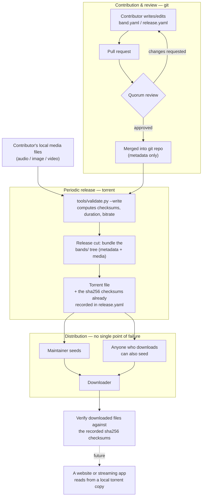

# Daugavpils Music Archive

Music from the Daugavpils (Latvia) music scene is scattered across
individual people's hard drives, cassettes, and memories, with no shared,
durable place to keep it.

This project solves the actual bottleneck first: a portable archive of
plain audio/image/video files plus schema-validated metadata, organized
by a documented folder convention, checksummed for integrity — reusable
by anyone, in any language, independent of any single website, hosting
arrangement, or maintainer.

## How this works, at a glance

The two layers stay separate all the way through: git carries the small,
reviewable **metadata**; torrents carry the actual **media**. Nothing
about "how do people get the music" depends on this GitHub repo staying
online, or on any one person's hosting bill.



In words: someone contributes a band's recordings by opening a pull
request against this repo with just the metadata (the actual files stay
local); the quorum reviews and merges it; periodically, someone with
release access bundles the current state of `bands/` — metadata plus
everyone's media files — into a **single, self-sufficient torrent**,
using the checksums already sitting in each `release.yaml` as the
built-in integrity manifest. That torrent is a complete, working copy of
the archive on its own — it needs no dependency on GitHub, or this repo,
or anyone's hosting still being alive to be useful. It gets seeded by
whoever chooses to (starting with the maintainer, ideally joined by
anyone who downloads it), so no single host or person disappearing takes
the archive down with them, and anyone downloading a copy can verify it's
intact independent of who they got it from. A website or streaming app is
a possible future consumer of that data — not a dependency of the archive
existing in the first place.

## What's actually portable here

The **archive** is `bands/` (audio/image/video files + YAML metadata)
plus `schema/` (the JSON Schema files describing what valid metadata
looks like). Those are plain text and media files — no database, no
server, no proprietary format. Anyone, in any language, can read and
validate them without this repo's Python tooling.

**Only the metadata is version-controlled, right now.** Audio/image/video
files live under `bands/` locally (`tools/validate.py` reads and
checksums them there) but are excluded from git (see `.gitignore`) — per
the model above, they're meant to reach people via a torrent release, not
by committing binaries into this repository's history.

**The git-tracked metadata is the contract a torrent release must
satisfy.** Each `release.yaml`/`band.yaml` declares exactly which files
must exist (`contentUrl`) and what their exact byte-content must be
(`sha256`, under `identifier`). `tools/validate.py` is what currently
enforces that contract — checking that every file the metadata claims
exists actually exists locally, with the checksum it claims. A release is
only ever cut from a local `bands/` tree that has already passed
`validate.py`, so a torrent inherits that guarantee by construction; there
isn't yet a separate automated "cut a release" tool that re-checks this at
release time (see the tickets tracking this repo's remaining work).

The **tooling** (`tools/`, Python + Pydantic) is a convenience layer for
*this* maintainer: it validates metadata against the schema and computes
checksums/audio properties. It is not part of the contract. `schema/*.schema.json`
is generated from `tools/models.py` — if you want to validate this archive
from Go, Node, or anything else, validate against those JSON Schema files
directly; you don't need Python.

## Layout

```
bands/
  <band-slug>/
    band.yaml                  # MusicGroup metadata
    media/                     # band-level photos/videos/posters, not tied
      band-photo.jpg           # to any one release (kept locally; gitignored,
      concert-poster.webp      # not committed)
      ...
    <release-slug>/
      release.yaml              # MusicAlbum metadata
      01-track-slug.mp3          # audio files, as originally sourced
      03-track-slug.mp3          # (kept locally; gitignored, not committed)
      ...
schema/
  band.schema.json              # JSON Schema for band.yaml (generated)
  release.schema.json           # JSON Schema for release.yaml (generated)
tools/
  models.py                     # Pydantic models (source of the schema)
  export_schema.py              # regenerates schema/*.schema.json
  validate.py                   # validates bands/ against the schema
docs/agents/                    # config consumed by AI coding-agent skills
                                 # (issue tracker, triage labels, domain docs)
                                 # - not part of the archive itself
webapp/                          # public website built from the archive (ADR-0001)
  build.py                       # renders bands/**/*.yaml into static HTML
  templates/, static/            # Jinja2 templates, CSS
  deploy/                        # docker-compose + nginx config run on the host
  dist/                          # generated output (gitignored, not committed)
```

### Naming convention

Folder and file names are **slugs**: short, plain-ASCII, URL-safe
versions of a name — lowercase, hyphens instead of spaces, no accents or
punctuation (e.g. band name `M. Spirit` → folder name `m-spirit`). Where
the real name is written in a non-Latin **script** (script = writing
system/alphabet — Cyrillic, Greek, Arabic, etc.; most of these bands'
names and song titles are in Cyrillic), the slug is a transliteration of
it into Latin letters. This keeps the archive safe for git, URLs,
filesystems, and torrent clients regardless of locale.

The real name, in its real script, is never lost — it's always preserved
in the metadata (`name`, and `alternateName` for other known spellings or
titles), never only encoded in the filename.

### Audio files

Files are kept in their original format and quality — **no forced
transcoding**. If a source is a 1995 cassette digitized to MP3 320kbps,
that's what's archived; the metadata records the true format
(`encodingFormat`, `bitrate`) rather than pretending it's something it
isn't. If a better-quality source ever surfaces, it gets added as
metadata evolves — files are never silently overwritten.

### Metadata schema

Metadata is authored as hand-editable YAML, aligned to
[schema.org](https://schema.org) vocabulary (`MusicGroup`, `MusicAlbum`,
`MusicRecording`, `AudioObject`, `ImageObject`, `VideoObject`), so it's
meaningful outside this project too (e.g. embeddable as JSON-LD on a
future website, for search engines). A couple of fields have no
schema.org equivalent and are handled with a documented convention rather
than an invented field name:

- **Checksums** use schema.org's generic `identifier` / `PropertyValue`
  pattern: `{"@type": "PropertyValue", "propertyID": "sha256", "value": "..."}`.
- **Band member role/period** (`member:` on a `MusicGroup`) is a
  minimal, non-standard structure (`name`, `role`, `period`), since
  schema.org has no standard way to attach a role and time period to a
  membership relationship.

**`contentUrl` is a relative path, not an absolute one.** schema.org
normally uses `contentUrl` for a real web URL, but since there's no
website hosting these files, it holds a path relative to wherever the
YAML file itself sits (e.g. `01-iashcher.mp3`, meaning "the file with
this name, next to me"). That's deliberate: it resolves correctly no
matter where the surrounding folder tree physically lives — your local
working copy, someone else's freshly downloaded torrent, a future
website's storage — as long as the relative structure inside the archive
stays intact.

Missing or unknown data is left out rather than invented. If a track is
lost or its title unknown, that gap is documented in the release's
`description`, not papered over with a placeholder.

### Photos and video

Both a band (`band.yaml`) and a release (`release.yaml`) can carry an
`image` list (band photos, cover art) and a `video` list (concert
footage, interviews, an official music video) — same shape and same
rules as audio: kept in original quality, referenced by a relative path,
checksummed, and excluded from git the same way audio files are.

### Licensing

Each release carries a `license` field (a URL, typically a Creative
Commons license chosen by the contributing artist/rights-holder — e.g.
`CC BY-NC-SA 4.0`). This is what makes redistribution via torrent legally
coherent — it must be decided per-release, by whoever holds the rights,
not assumed archive-wide.

### Integrity

Every track's metadata carries a `sha256` checksum, computed and
verified by `tools/validate.py`. This means:

- Anyone can verify a copy of the archive (or of a single file) hasn't
  been corrupted or tampered with, independent of where they got it from.
- When this archive is eventually released as a torrent, the checksums
  already recorded here double as the verification manifest — no
  separate step needed later.

## Design precedents & current status

This mirrors how [MusicBrainz](https://musicbrainz.org) separates
metadata governance from file hosting entirely, and how
[etree.org](https://bt.etree.org)/No-Intro-style projects use a small
trusted circle plus a written admission policy and torrent/mirror
distribution instead of centralized paid hosting.

A public website now exists (see `webapp/` and ADR-0001) - a static site
built from the same archive and hosted separately from it, not a
replacement for the torrent distribution model above. Still explicitly out
of scope: actual torrent creation, and inviting other contributors.

## Tooling usage

```bash
python3 -m venv .venv && source .venv/bin/activate
pip install -r tools/requirements.txt

# after editing models.py:
python tools/export_schema.py

# check the archive, or add a new band/release:
python tools/validate.py                          # check only
python tools/validate.py --write                  # also compute missing checksums/duration/bitrate
python tools/validate.py --bands-dir path/to/dir   # validate a different directory (e.g. a test fixture)
```
