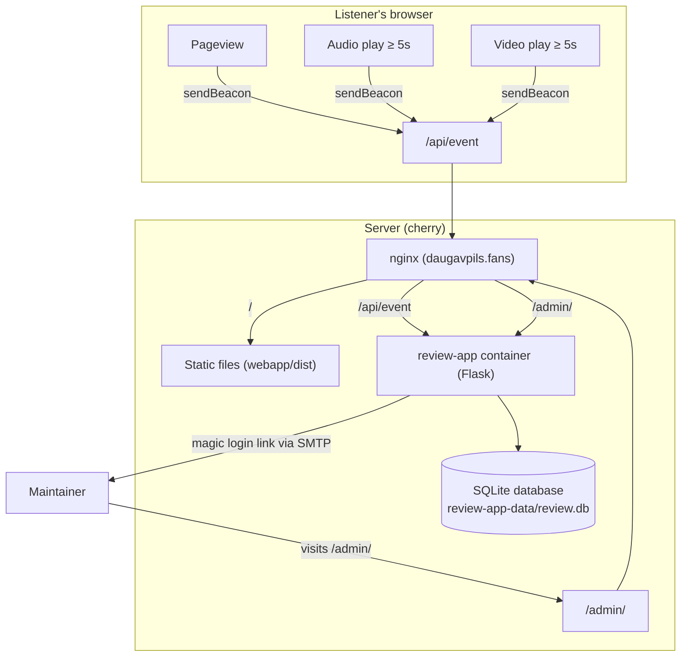

# Site maintainer statistics and analytics (`/admin/`)

The site includes a self-hosted, privacy-preserving visitor and media analytics system with an administrative dashboard at **`https://daugavpils.fans/admin/`**.

It answers essential questions for the site maintainer:
- How many people visit the archive, and how is traffic trending?
- Which bands and releases receive the most attention?
- Which individual audio tracks are actually listened to, and which videos are watched?
- Where are listeners coming from (search engines, external sites, direct)?
- Which countries and languages (Russian vs. English) are visitors using?

---

## 1. Privacy & GDPR compliance

The analytics system is intentionally designed to be **100% cookie-free** and fully privacy-preserving:

1. **No tracking cookies or storage**: No cookies or `localStorage` tokens are set in visitor browsers for analytics. No cookie consent banners or prompts are required.
2. **Daily-rotating salted visitor hash**: Unique daily visitors are counted without storing raw IP addresses:
   $$\text{visitor\_hash} = \text{SHA256}(\text{IP} + \text{User-Agent} + \text{salt})$$
   The `salt` is derived from `SECRET_KEY + YYYY-MM-DD` (UTC day). This allows deduplicating visits by the same person on the same day, while ensuring:
   - A visitor cannot be tracked across different days.
   - The visitor's IP address cannot be reversed or reconstructed from the hash.
   - External parties cannot correlate visitor hashes without knowing `SECRET_KEY`.
3. **Automated bot & crawler filtering**: Search engine spiders (Googlebot, Bingbot, Yandex), AI scrapers (Bytespider, GPTBot, ClaudeBot), and command-line tools (`curl`, `python-requests`) are automatically filtered out server-side using User-Agent pattern matching. Their requests are dropped with `204 No Content` and never pollute analytics counts.

---

## 2. Media playback tracking (≥ 5 seconds)

Media files (audio tracks and videos) stream directly from archive.org rather than our server (see `CONTEXT.md`). Server access logs alone cannot see media consumption.

To track media engagement:
- `webapp/static/stats.js` attaches lightweight listeners to HTML5 `<audio>` and `<video>` elements.
- Playback time is accumulated during active playback (ignoring seek jumps > 2 seconds).
- A `track_play` or `video_play` event is fired only after **5 cumulative seconds** of active playback.
- This 5-second threshold deliberately filters out accidental clicks, immediate pauses, and rapid track skipping to record genuine listens.
- Events are deduplicated per media item within the page session so pausing and resuming does not double-count.

---

## 3. Maintainer authentication (`/admin/`)

Access to the statistics dashboard is strictly restricted to the address configured in `MAINTAINER_EMAIL`.

1. **Passwordless email magic link**:
   - Visiting `/admin/` while unauthenticated presents a clean login form.
   - Submitting an email matching `MAINTAINER_EMAIL` generates a cryptographically secure 32-byte token and emails a magic link: `https://daugavpils.fans/admin/verify?token=...`.
   - The login form returns an identical confirmation message regardless of whether the email matched, preventing maintainer email enumeration.
2. **Single-use and expiration**:
   - Magic links expire in **15 minutes**.
   - Verification uses an atomic SQL `UPDATE` check (`WHERE used_at IS NULL AND expires_at > datetime('now')`), ensuring the token can only ever be used once.
3. **Rate limiting**:
   - Login attempts are rate-limited per IP per hour (`LOGIN_RATE_LIMIT_PER_IP_PER_HOUR`), logged in `admin_login_request_log`.
4. **Session**:
   - A verified session sets an encrypted `is_admin` session cookie (`HttpOnly`, `SameSite=Lax`, `Secure`).
   - A visible "Log out" button clears the session.

---

## 4. Dashboard metrics and layout

The dashboard (`https://daugavpils.fans/admin/`) displays:

- **Time Range Filters**: Toggle between **Today**, **Last 7 Days**, **Last 30 Days**, and **All Time**.
- **Summary Cards**:
  - Unique Visitors
  - Total Pageviews
  - Audio Listens (≥ 5s)
  - Video Views (≥ 5s)
- **Top Audio Tracks**: Ranked list of tracks with band, album, total listen count, and visual percentage bars.
- **Top Videos**: Ranked list of watched videos and view counts.
- **Top Pages**: Most visited band and album pages.
- **Referrers & Geography**:
  - Top external referrers (e.g. Google, Yandex, Facebook, direct).
  - Top countries detected from reverse proxy headers (`CF-IPCountry`, `X-Country`).
  - Language breakdown (Russian `/` vs. English `/en/`).
  - Device distribution (Desktop, Mobile, Tablet).
- **Recent Activity Feed**: Real-time ticker of the last 15 recorded events with event type badges and timestamps.

---

## 5. Implementation details

| Component | File | Purpose |
| :--- | :--- | :--- |
| **Client Beacon** | [`webapp/static/stats.js`](../webapp/static/stats.js) | Sends pageview beacons and listens for ≥ 5s media playback. |
| **Event Ingestion** | [`review_app/analytics.py`](../review_app/analytics.py) | `POST /api/event` route, bot filtering, salted hashing, country and device detection. |
| **Admin Controller** | [`review_app/admin.py`](../review_app/admin.py) | `/admin/` routes, login request, magic link verification, aggregation queries. |
| **Email Delivery** | [`review_app/mail.py`](../review_app/mail.py) | `send_admin_magic_link()` dispatches login links via configured SMTP relay. |
| **Database Schema** | [`review_app/schema.sql`](../review_app/schema.sql) | Tables: `analytics_events`, `admin_magic_links`, `admin_login_request_log`. |
| **Dashboard UI** | [`review_app/templates/admin/`](../review_app/templates/admin/) | Templates for login, verification, and statistics dashboard. |
| **Reverse Proxy** | [`webapp/deploy/nginx/daugavpils.conf`](../webapp/deploy/nginx/daugavpils.conf) | Routes `/admin` and `/api/event` to `review-app:8000`. |
