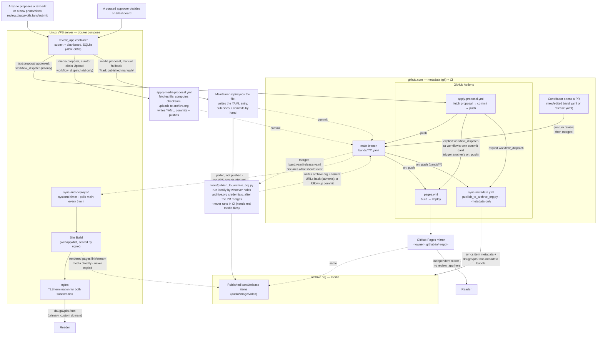

# Site deployment architecture

This is the map: where metadata and media actually live, and how a
change (a merged PR, or an approved review-app proposal) ends up live.
It's deliberately a **current-state overview, not a decision record and
not a runbook**:

- For *why* it's built this way, see `docs/adr/0001-static-site-build-for-public-website.md`,
  `docs/adr/0002-github-pages-mirror-via-ci.md`, and
  `docs/adr/0003-public-proposal-app-live-server.md`.
- For the exact, runnable commands to stand this up on a fresh server, or
  redeploy by hand, see [`webapp/deploy/README.md`](../webapp/deploy/README.md)
  - this doc doesn't repeat those steps, so it can't drift from them.

This covers **infrastructure/deployment topology only** - not how the
application code itself (`webapp/build.py`, `review_app/`, `tools/`) is
organized internally.

## The two independent Site Build paths

The same `webapp/build.py`, run twice, two different ways - either one
being unreachable doesn't take the Site down (see ADR-0002, and
README.md's "Resilience" section for the reasoning):

- **The Linux VPS server (primary, custom domain).** A `systemd` timer
  (`sync-and-deploy.sh`) polls `main` every 5 minutes and, if it's moved,
  builds a fresh Site Build and atomically re-points nginx's `current`
  symlink at it. GitHub never gets inbound access to this box - it pulls,
  nothing pushes to it. Because this box has no local media tree, it
  builds with `SITE_SKIP_LOCAL_VALIDATION=1`, trusting archive.org's
  already-published checksums. A maintainer can still build+rsync by hand
  for a fully-verified, on-demand deploy - see `webapp/deploy/README.md`.
- **GitHub Pages (mirror).** `.github/workflows/pages.yml` runs on every
  push to `main` (and on manual `workflow_dispatch`), builds the same way
  (`SITE_SKIP_LOCAL_VALIDATION=1` - CI has no local media tree either),
  and publishes to this repo's default Pages URL. No `review_app` here;
  this is a read-only mirror.

## `review_app` and the approval pipeline

`review_app` (ADR-0003) is the one live server process in an otherwise
static-site system - a second container on the same VPS, reachable only
through nginx (`review.daugavpils.fans`), with its own SQLite database
(not backed up - see ADR-0003's Consequences). It never holds any
credential that can push to git, and never holds archive.org credentials
at all.

It handles two kinds of proposal, decided the same way on the same
`/dashboard` (one curated approver, no quorum, self-approval blocked -
see ADR-0003's Consequences) but applied completely differently once
approved:

- **Text proposals** (issue #13, #33) - approving dispatches
  `apply-proposal.yml` with just the proposal's id. That Action fetches
  the actual content from `review_app`'s authenticated callback API,
  commits it, and pushes to `main`. Because a workflow's own commit can't
  trigger another workflow's `on: push` (a GitHub anti-recursion rule),
  `apply-proposal.yml` explicitly dispatches `pages.yml` and
  `sync-metadata.yml` right after pushing. `sync-metadata.yml` runs
  `publish_to_archive_org.py --metadata-only` to ensure archive.org's
  item metadata and `daugavpils-fans-metadata` backup bundle immediately
  reflect the updated golden source of truth in git. The VPS's timer
  picks the same push up on its own next poll, no dispatch needed there.
- **Media proposals** (issue #21, automated in issue #36) - approving
  itself never dispatches anything; it only moves the upload to a "ready
  to publish" list on the dashboard. From there a curator normally
  clicks "Upload", which dispatches `apply-media-proposal.yml` with the
  proposal's id, the same `workflow_dispatch (id only)` shape as the
  text-proposal path. That Action fetches the file and metadata from
  `review_app`'s callback API, runs `tools/apply_media_proposal.py` to
  derive a filename, compute its checksum (and, for video,
  duration/bitrate via `ffprobe`), write the `image`/`video` entry into
  `band.yaml`/`release.yaml`, upload the file to the item on
  archive.org, sync metadata, and commit/push to `main` - then reports
  success/failure back so the dashboard can show "published" or "upload
  failed". A "Mark published manually" fallback still exists for a
  curator who'd rather do it by hand: retrieve the file (`scp`/`rsync`
  from `review-app-data/uploads/` on the VPS - see
  `webapp/deploy/README.md`), write the YAML entry, run
  `tools/validate.py --write` then `tools/publish_to_archive_org.py`,
  and commit/push directly - the same manual process as "Adding a new
  band, release, or media" below.

`apply-proposal.yml`, `apply-media-proposal.yml`, and `pages.yml` each
use their own `concurrency:` group (`apply-proposal`,
`apply-media-proposal`, and `pages` respectively) so that proposals
approved seconds apart apply one at a time instead of racing, and a
Pages deploy already in flight is never killed mid-way by a newer one.

That concurrency group only protects one *running* + one *queued* run,
though - GitHub silently evicts an older *queued* run when a third
dispatch arrives while it's still waiting, rather than stacking it. A
burst of three-plus approvals within seconds of each other can therefore
drop a proposal's dispatch entirely - not a failed run, one that never
started (see GitHub issue #28; confirmed in production with proposal #13
on 2026-09-09). Both `apply-proposal.yml` and `apply-media-proposal.yml`
also run on a 15-minute `schedule` as a result: a schedule-triggered run
(or a manual dispatch with `proposal_id` left blank) fetches every
proposal still at `status='approved'` (`GET /api/proposals/approved` or
`/api/media-proposals/approved`) and applies all of them in one run, so
a dropped dispatch is caught by the next sweep instead of sitting stuck
indefinitely. The approval-driven fast path (dispatch with a specific
`proposal_id`) is unchanged for the common
case; the sweep is purely the safety net. Separately, the same commit
that added the sweep also made the "commit and push" step itself retry
with `git fetch && git rebase` a few times on a rejected push, since a
run can still race a *manual* push made outside any workflow run (which
the concurrency group does nothing for either).

## Adding a new band, release, or media

This is a separate story from *redeploying* the Site (everything above),
and doesn't touch this deploy pipeline at all - it's how content gets
into the two homes the pipeline then serves from:

- **Metadata (git)**: a contributor opens a PR with a new/edited
  `band.yaml`/`release.yaml`; quorum review merges it to `main` like any
  other PR. `review_app`'s lighter-weight `/submit` flow (above) covers
  *correcting* an existing field or contributing a new photo/video to an
  *existing* band/release, never adding a whole new band or release -
  that still needs a PR.
- **Media (archive.org)**: after the PR is merged (or, for a `review_app`
  media proposal, after a maintainer's picked it up from the "ready to
  publish" queue - same step either way), whoever holds the project's
  archive.org credentials runs `tools/publish_to_archive_org.py`
  **locally** - it needs the real audio/image/video files, which are
  gitignored and never reach GitHub, so this step can't run in CI. It
  uploads the media as its own archive.org item, then writes the
  resulting archive.org/torrent URLs back into `sameAs` as a follow-up
  commit.

Until that publish step runs, a merged PR's media won't resolve on
either Site Build - `webapp/build.py` refuses to build if it references
media that isn't confirmed to exist yet (see `require_media_published`,
ADR-0002). See README.md's "How this works, at a glance" diagram for the
full reasoning, and "Adding a new band, step by step" for the exact
commands.

## Certificates

TLS terminates at nginx on the VPS, one Let's Encrypt cert (DNS-01 via
Cloudflare) covering `daugavpils.fans`, `www`, and
`review.daugavpils.fans`. Issuance and renewal steps: see
`webapp/deploy/README.md`'s "Cert renewal" section.

## Statistics and maintainer admin (`/admin/`)

The primary domain (`daugavpils.fans`) proxies `/admin/` and `/api/event`
to the `review-app` container, providing a self-hosted, privacy-preserving
analytics system and statistics dashboard for the maintainer without
exposing an external SaaS tracker or requiring cookies.

See [`documentation/ANALYTICS.md`](ANALYTICS.md) for full architectural,
privacy, and operational details.
