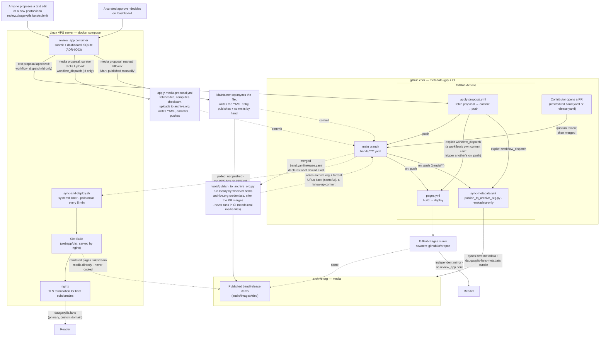

# Site deployment architecture

This is the map: where metadata and media actually live, and how a
change (a merged PR, or an approved review-app proposal) ends up live.
It's deliberately a **current-state overview, not a decision record and
not a runbook**:

- For *why* it's built this way, see `docs/adr/0001-static-site-build-for-public-website.md`,
  `docs/adr/0002-github-pages-mirror-via-ci.md`, and
  `docs/adr/0003-public-proposal-app-live-server.md`.
- For the exact, runnable commands to stand this up on a fresh server, or
  redeploy by hand, see [`webapp/deploy/README.md`](../webapp/deploy/README.md)
  - this doc doesn't repeat those steps, so it can't drift from them.

This covers **infrastructure/deployment topology only** - not how the
application code itself (`webapp/build.py`, `review_app/`, `tools/`) is
organized internally.

## The two independent Site Build paths

The same `webapp/build.py`, run twice, two different ways - either one
being unreachable doesn't take the Site down (see ADR-0002, and
README.md's "Resilience" section for the reasoning):

- **The Linux VPS server (primary, custom domain).** A `systemd` timer
  (`sync-and-deploy.sh`) polls `main` every 5 minutes and, if it's moved,
  builds a fresh Site Build and atomically re-points nginx's `current`
  symlink at it. GitHub never gets inbound access to this box - it pulls,
  nothing pushes to it. Because this box has no local media tree, it
  builds with `SITE_SKIP_LOCAL_VALIDATION=1`, trusting archive.org's
  already-published checksums. A maintainer can still build+rsync by hand
  for a fully-verified, on-demand deploy - see `webapp/deploy/README.md`.
- **GitHub Pages (mirror).** `.github/workflows/pages.yml` runs on every
  push to `main` (and on manual `workflow_dispatch`), builds the same way
  (`SITE_SKIP_LOCAL_VALIDATION=1` - CI has no local media tree either),
  and publishes to this repo's default Pages URL. No `review_app` here;
  this is a read-only mirror.

## `review_app` and the approval pipeline

`review_app` (ADR-0003) is the one live server process in an otherwise
static-site system - a second container on the same VPS, reachable only
through nginx (`review.daugavpils.fans`), with its own SQLite database
(not backed up - see ADR-0003's Consequences). It never holds any
credential that can push to git, and never holds archive.org credentials
at all.

It handles four kinds of proposals, decided on `/dashboard` (or by the
autonomous AI agent; one curated approver, no quorum, self-approval blocked -
see ADR-0003's Consequences) and applied via dedicated GitHub Actions workflows:

- **Text proposals** (issues #13, #33) - approving dispatches
  `apply-proposal.yml` with just the proposal's id. That Action fetches
  the actual content from `review_app`'s authenticated callback API,
  commits it, and pushes to `main`. Because a workflow's own commit can't
  trigger another workflow's `on: push` (a GitHub anti-recursion rule),
  `apply-proposal.yml` explicitly dispatches `pages.yml` and
  `sync-metadata.yml` right after pushing. `sync-metadata.yml` runs
  `publish_to_archive_org.py --metadata-only` to ensure archive.org's
  item metadata and `daugavpils-fans-metadata` backup bundle immediately
  reflect the updated golden source of truth in git. The VPS's timer
  picks the same push up on its own next poll, no dispatch needed there.
- **Media proposals** (issues #21, #36) - approving moves the upload to a
  "ready to publish" list where clicking "Upload" (or AI agent auto-approval)
  dispatches `apply-media-proposal.yml`. That Action fetches the file and
  metadata from `review_app`'s callback API, runs `tools/apply_media_proposal.py`
  to derive a filename, compute its checksum (and, for video, duration/bitrate via
  `ffprobe`), write the `image`/`video` entry into `band.yaml`/`release.yaml`,
  upload the file to the item on archive.org, sync metadata, and commit/push to
  `main`. A "Mark published manually" fallback still exists for a curator who'd
  rather do it by hand.
- **Album proposals** (issue #20) - community submission of new releases
  (`/submit/<band>/add-release`) with multi-track audio upload and cover art.
  Enforces a 24-hour rate limit (max 3 releases published per rolling 24 hours).
  Approving dispatches `apply-album-proposal.yml`, which downloads tracks, probes
  audio with `ffprobe`, computes SHA-256 checksums, writes `release.yaml`, uploads
  to archive.org (`daugavpils-fans-<band>-<release>`), and commits/pushes to `main`.
- **Band proposals** (issue #22) - community submission of brand-new bands
  (`/submit/add-band`) with biography, photo, and optional first release.
  Enforces a 24-hour rate limit (max 1 new band published per rolling 24 hours).
  Approving dispatches `apply-band-proposal.yml`, which creates `band.yaml`, media,
  optional release, uploads to archive.org, and commits/pushes to `main`.

### AI Approval Agent (issue #43)

`review_app` includes an autonomous AI approval agent (`review_app/ai_agent.py`) that evaluates incoming proposals asynchronously upon submission:

- **Model and Endpoint**: Uses the Z-AI (`glm-5.1`) model configured on the VPS (reusing the local instance on `cherry`), or an OpenAI-compatible multimodal endpoint.
- **Autonomy**:
  - **Text proposals**: High-confidence approvals ($\ge 0.80$, typos, verified links, non-vandalous biography expansions, member additions) are auto-approved under the dedicated `AI Approval Agent` system identity and dispatch `apply-proposal.yml` immediately.
  - **Media proposals**: High-confidence archival photos and artwork are auto-approved under `AI Approval Agent` and automatically dispatch `apply-media-proposal.yml` to upload to archive.org and commit to git `main`.
  - **Ambiguous or non-trivial proposals**: Escalated to the maintainer via email with the AI's confidence, hesitation reasoning, diff/preview, and dashboard link.
- **Modes**: Controlled by `AI_APPROVAL_MODE`:
  - `active`: Full autonomous approvals and workflow dispatch enabled.
  - `shadow`: Evaluates and logs reasoning to SQLite and sends shadow notifications, but does not auto-dispatch workflows.
  - `disabled`: Bypassed; standard manual review flow.

### Decision history and 90-day retention log

The curation dashboard includes a dedicated decision history and audit log at `/dashboard/history` (`review_app/dashboard.py`):

- **Audit trail**: Every moderation decision across all four submission types (text corrections, media files, new albums, new band profiles) records the decision timestamp (`decided_at`), decision status (`approved`, `rejected`), the decider attribution (`decided_by` — human curator email vs `AI Approval Agent`), and any curator review notes or AI hesitation reasoning.
- **Filtering**: Curators can filter the audit log by timeframe (past 7 days, 30 days, 90 days, or all time), status (`approved`, `rejected`), and proposal type (`text`, `media`, `album`, `band`).
- **90-Day automatic retention**: Completed decisions (`applied`, `published`, or `rejected`) are rotated out after 90 days (`prune_old_decided_proposals()` in `review_app/db.py`). The routine is executed automatically during database initialization and whenever `/dashboard/history` is queried. Pending or in-flight proposals are never pruned.

### Outbound email delivery (Resend SMTP)

`review_app` uses **Resend** (`smtp.resend.com:587`) as its outbound SMTP relay for approver/admin magic login links and proposal notification alerts. Emails originate from `noreply@daugavpils.fans` (authenticated via DKIM and SPF records in Cloudflare DNS). Using a dedicated transactional relay completely decouples server notifications from personal maintainer email accounts.

### Workflow concurrency and recovery sweeps

`apply-proposal.yml`, `apply-media-proposal.yml`, and `pages.yml` each
use their own `concurrency:` group (`apply-proposal`,
`apply-media-proposal`, and `pages` respectively) so that proposals
approved seconds apart apply one at a time instead of racing, and a
Pages deploy already in flight is never killed mid-way by a newer one.

That concurrency group only protects one *running* + one *queued* run,
though - GitHub silently evicts an older *queued* run when a third
dispatch arrives while it's still waiting, rather than stacking it. A
burst of three-plus approvals within seconds of each other can therefore
drop a proposal's dispatch entirely - not a failed run, one that never
started (see GitHub issue #28; confirmed in production with proposal #13
on 2026-09-09). Both `apply-proposal.yml` and `apply-media-proposal.yml`
also run on a 15-minute `schedule` as a result: a schedule-triggered run
(or a manual dispatch with `proposal_id` left blank) fetches every
proposal still at `status='approved'` (`GET /api/proposals/approved` or
`/api/media-proposals/approved`) and applies all of them in one run, so
a dropped dispatch is caught by the next sweep instead of sitting stuck
indefinitely. The approval-driven fast path (dispatch with a specific
`proposal_id`) is unchanged for the common
case; the sweep is purely the safety net. Separately, the same commit
that added the sweep also made the "commit and push" step itself retry
with `git fetch && git rebase` a few times on a rejected push, since a
run can still race a *manual* push made outside any workflow run (which
the concurrency group does nothing for either).

## Adding a new band, release, or media

This is a separate story from *redeploying* the Site (everything above),
and doesn't touch this deploy pipeline at all - it's how content gets
into the two homes the pipeline then serves from:

- **Community contributions (review_app)**: anyone can propose text corrections,
  photos/videos, brand-new releases (`/submit/<band>/add-release`), or entirely new
  bands (`/submit/add-band`). Approved submissions automatically trigger GitHub Actions
  workflows that upload media directly to archive.org, compute checksums/properties,
  and commit changes to `main`.
- **Direct PR workflow (git)**: a contributor or maintainer can also open a PR
  with a new/edited `band.yaml`/`release.yaml` authored locally; quorum review
  merges it to `main` like any other PR.
- **Media (archive.org)**: after the PR is merged (or, for a `review_app`
  media proposal, after a maintainer's picked it up from the "ready to
  publish" queue - same step either way), whoever holds the project's
  archive.org credentials runs `tools/publish_to_archive_org.py`
  **locally** - it needs the real audio/image/video files, which are
  gitignored and never reach GitHub, so this step can't run in CI. It
  uploads the media as its own archive.org item, then writes the
  resulting archive.org/torrent URLs back into `sameAs` as a follow-up
  commit.

Until that publish step runs, a merged PR's media won't resolve on
either Site Build - `webapp/build.py` refuses to build if it references
media that isn't confirmed to exist yet (see `require_media_published`,
ADR-0002). See README.md's "How this works, at a glance" diagram for the
full reasoning, and "Adding a new band, step by step" for the exact
commands.

## Certificates

TLS terminates at nginx on the VPS, one Let's Encrypt cert (DNS-01 via
Cloudflare) covering `daugavpils.fans`, `www`, and
`review.daugavpils.fans`. Issuance and renewal steps: see
`webapp/deploy/README.md`'s "Cert renewal" section.

## Statistics and maintainer admin (`/admin/`)

The primary domain (`daugavpils.fans`) proxies `/admin/` and `/api/event`
to the `review-app` container, providing a self-hosted, privacy-preserving
analytics system and statistics dashboard for the maintainer without
exposing an external SaaS tracker or requiring cookies.

See [`documentation/ANALYTICS.md`](ANALYTICS.md) for full architectural,
privacy, and operational details.
