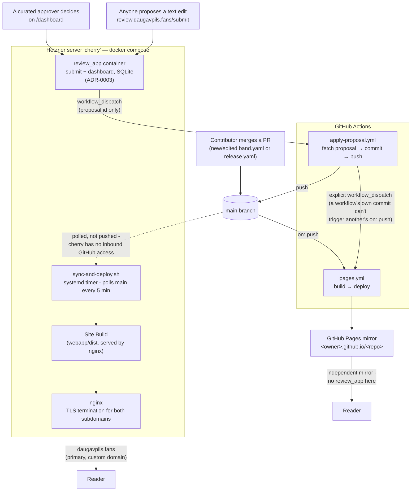

# Site deployment architecture

This is the map: what runs where, and how a change (a merged PR, or an
approved review-app proposal) ends up live. It's deliberately a
**current-state overview, not a decision record and not a runbook**:

- For *why* it's built this way, see `docs/adr/0001-static-site-build-for-public-website.md`,
  `docs/adr/0002-github-pages-mirror-via-ci.md`, and
  `docs/adr/0003-public-proposal-app-live-server.md`.
- For the exact, runnable commands to stand this up on a fresh server, or
  redeploy by hand, see [`webapp/deploy/README.md`](../webapp/deploy/README.md)
  - this doc doesn't repeat those steps, so it can't drift from them.

This covers **infrastructure/deployment topology only** - not how the
application code itself (`webapp/build.py`, `review_app/`, `tools/`) is
organized internally.

## The two independent Site Build paths

The same `webapp/build.py`, run twice, two different ways - either one
being unreachable doesn't take the Site down (see ADR-0002, and
README.md's "Resilience" section for the reasoning):

- **`cherry` (primary, custom domain).** A `systemd` timer
  (`sync-and-deploy.sh`) polls `main` every 5 minutes and, if it's moved,
  builds a fresh Site Build and atomically re-points nginx's `current`
  symlink at it. GitHub never gets inbound access to this box - it pulls,
  nothing pushes to it. Because this box has no local media tree, it
  builds with `SITE_SKIP_LOCAL_VALIDATION=1`, trusting archive.org's
  already-published checksums. A maintainer can still build+rsync by hand
  for a fully-verified, on-demand deploy - see `webapp/deploy/README.md`.
- **GitHub Pages (mirror).** `.github/workflows/pages.yml` runs on every
  push to `main` (and on manual `workflow_dispatch`), builds the same way
  (`SITE_SKIP_LOCAL_VALIDATION=1` - CI has no local media tree either),
  and publishes to this repo's default Pages URL. No `review_app` here;
  this is a read-only mirror.

## `review_app` and the approval pipeline

`review_app` (ADR-0003) is the one live server process in an otherwise
static-site system - a second container on `cherry`, reachable only
through nginx (`review.daugavpils.fans`), with its own SQLite database
(not backed up - see ADR-0003's Consequences). It never holds any
credential that can push to git.

Approving a proposal on `/dashboard` doesn't apply it directly - it
dispatches `apply-proposal.yml` with just the proposal's id.
That Action fetches the actual content from `review_app`'s authenticated
callback API, commits it, and pushes to `main`. Because a workflow's own
commit can't trigger another workflow's `on: push` (a GitHub
anti-recursion rule), `apply-proposal.yml` explicitly dispatches
`pages.yml` itself right after pushing - the `cherry` timer picks the
same push up on its own next poll, no dispatch needed there.

Both `apply-proposal.yml` and `pages.yml` use a `concurrency:` group
(`apply-proposal` and `pages` respectively) so that proposals approved
seconds apart apply one at a time instead of racing, and a Pages
deploy already in flight is never killed mid-way by a newer one.

## Media and certificates (brief - see elsewhere for detail)

- **Media itself never touches this deploy pipeline.** Audio/image/video
  live on archive.org, not on `cherry` or in git - see README.md's "How
  this works, at a glance" diagram for that story; it's the Archive's
  distribution model, not the Site's deployment.
- **TLS terminates at nginx on `cherry`**, one Let's Encrypt cert (DNS-01
  via Cloudflare) covering `daugavpils.fans`, `www`, and
  `review.daugavpils.fans`. Issuance and renewal steps: see
  `webapp/deploy/README.md`'s "Cert renewal" section.
