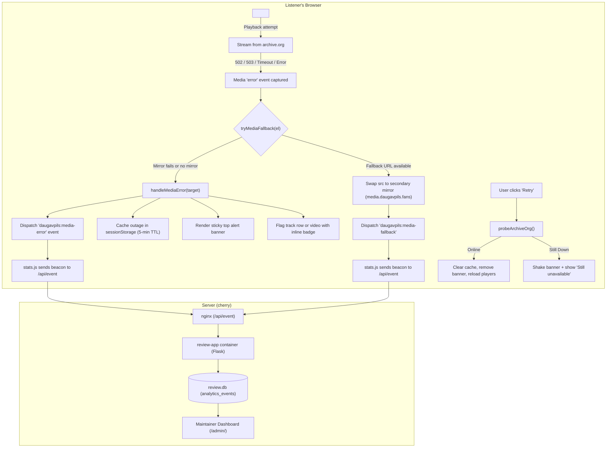

# Internet Archive (`archive.org`) Outage Detection & Notification

All audio and video media files for the Daugavpils Music Archive (`daugavpils.fans`) stream directly from Internet Archive servers (`https://archive.org/download/...`). When Internet Archive suffers global maintenance, downtime, or CDN degradation (HTTP 502 Bad Gateway, 503 Service Unavailable, or connection timeouts), audio and video playback silently fails in the visitor's browser.

Without an explicit notification system, listeners often assume their own browser, computer, or internet connection is broken (e.g., assuming audio drivers or Windows needs reinstallation).

This feature detects Internet Archive outages in real time on the client side, presents clear bilingual notifications, enables manual re-checks via a "Retry" button, and logs telemetry events to the `/admin/` dashboard.

---

## 1. Architecture & Flow



---

## 2. Component Breakdown

### 2.1 Client-Side Detection & Automatic Fallback (`webapp/static/player.js`)
- **Event capture**: Listens for the `error` event in the capture phase on `<audio>`, `<video>`, and `<source>` elements.
- **Transparent secondary mirror fallback (`tryMediaFallback`)**:
  - Before declaring an outage, the player checks if the failed source matches `archive.org/download/...` or `/media-stream/...`.
  - Converts the URL to the secondary mirror: `https://media.daugavpils.fans/<item_id>/<file>` (or custom prefix configured in `window.DAUGAVPILS_MEDIA_MIRROR`).
  - Swaps `mediaEl.src` to the mirror URL, sets `dataset.fallbackTried = "1"` to prevent infinite loops, calls `mediaEl.load()` and `mediaEl.play()`, and dispatches a `daugavpils:media-fallback` event.
  - Only if the secondary mirror source also fails does `handleMediaError` declare an outage.
- **Inline status (on secondary mirror failure)**:
  - The failed track row receives the `.media-outage-row` CSS class and an inline warning badge:
    - Russian: `⚠️ сбой archive.org`
    - English: `⚠️ archive.org error`
  - Video lightboxes receive the `.media-outage-state` CSS class with an inline warning inside the `<figure>`.

### 2.2 Top Sticky Alert Banner (`#archive-outage-banner`)
- Rendered dynamically at the top of `document.body` as an accessible `<aside role="alert" aria-live="assertive">`.
- Styled with `position: sticky; top: 0; z-index: 1000;` using high-contrast colors matching the archive's dark palette (`#3b180d` background, `#ff922b` border and accents, `#ffd8a8` text).
- **Bilingual copy** determined by the page language (`<html lang="ru|en">`):
  - **Russian (`ru`)**:
    > ⚠️ **Сервера Internet Archive (archive.org) временно недоступны.** Воспроизведение аудио и видео сейчас может не работать из-за временного сбоя на стороне архива. Ваш компьютер и браузер в порядке.  
    > `[ Попробовать снова ]` `[ ✕ ]`
  - **English (`en`)**:
    > ⚠️ **Internet Archive (archive.org) servers are temporarily unavailable.** Audio and video playback may not work right now due to a temporary outage on archive.org. Your computer and browser are working properly.  
    > `[ Retry ]` `[ ✕ ]`
- **Actions**:
  - **Retry ("Попробовать снова" / "Retry")**:
    - Disables button and displays `"Проверка связи..."` / `"Checking..."`.
    - Probes `https://archive.org/services/img/internetarchive` with a 3-second timeout.
    - If archive.org is accessible: clears the cached outage, dismisses the banner, removes inline track warnings, and reloads media elements via `mediaEl.load()`.
    - If still down: shakes the banner with a CSS keyframe animation (`archive-outage-shake`), displays `"Сервера всё ещё недоступны"` / `"Servers are still unavailable"`, and restores the button after 1.5 seconds.
  - **Dismiss ("✕")**:
    - Hides the banner and sets `sessionStorage.setItem('daugavpils-fans:archive-outage-dismissed', '1')`.
    - If the user explicitly clicks play on another failed track, the dismissed flag is cleared and the banner reappears.

### 2.3 Session Persistence (`sessionStorage`)
- When an outage is detected, the status is cached in `sessionStorage` under `daugavpils-fans:archive-outage`:
  ```json
  { "down": true, "timestamp": 1789211000000 }
  ```
- **TTL**: 5 minutes (300,000 ms).
- On subsequent page navigations during the session, `DOMContentLoaded` checks the cache and automatically renders the banner so users immediately know archive.org remains unavailable without having to re-trigger a failed playback.

### 2.4 Telemetry & Maintainer Monitoring (`stats.js` & `analytics.py`)
- **Fallback events (`media_fallback`)**:
  - Emitted when a track swaps to the secondary mirror. `stats.js` captures `daugavpils:media-fallback` and transmits:
    ```json
    {
      "type": "media_fallback",
      "path": "/bands/glazki-stekolshika/chernovyaki/",
      "track": "05-ivanovo.mp3",
      "band": "glazki-stekolshika",
      "release": "chernovyaki"
    }
    ```
- **Outage error events (`media_error`)**:
  - Emitted when both primary and secondary sources fail. `stats.js` captures `daugavpils:media-error` and transmits:
    ```json
    {
      "type": "media_error",
      "path": "/bands/glazki-stekolshika/chernovyaki/",
      "track": "05-ivanovo.mp3",
      "band": "glazki-stekolshika",
      "release": "chernovyaki"
    }
    ```
- `review_app/analytics.py` accepts and logs both event types into SQLite table `analytics_events`.
- `review_app/admin.py` counts media errors and mirror fallbacks across the active time filter (`Today`, `7d`, `30d`, `All Time`).
- The admin dashboard (`/admin/`) displays dedicated summary cards:
  - **Media Errors (archive.org)**: Outages where media could not be played.
  - **Mirror Fallbacks (B2/Proxy)**: Successful graceful transitions to the secondary mirror.

---

## 3. Build & Deployment Outage Resilience (`webapp/build.py`)

During static site generation (`webapp/build.py`), `require_media_published()` checks that all referenced media exists on archive.org before publishing. If Internet Archive is suffering an outage returning HTTP 502/503:
- The build script first performs a 3-second probe against `https://archive.org/metadata/daugavpils-fans-dvinsk`.
- If unreachable or returning a server error, the publication check is fast-skipped with a clear warning:
  ```
  WARNING: archive.org is unreachable (...); skipping media publication check
  ```
- If an individual item metadata call raises an error, `ArchiveOrgUnavailableError` aborts the remaining item checks immediately, preventing build timeouts or exponential backoff hangs.

---

## 4. Nginx Stale Media Proxy Cache (`/media-stream/`)

To prevent audio and video playback outages when archive.org suffers prolonged downtime (502/503/timeouts), server `cherry` operates a persistent, bounded media proxy cache configured in `webapp/deploy/nginx/daugavpils.conf`:

- **Bounded disk cache (`10g`)**: Media files are cached under `/var/cache/nginx/media` with `max_size=10g`, 30-day inactive expiration (`inactive=30d`), and a 50MB shared memory zone (`keys_zone=archive_media_cache:50m`). The cache is persisted across container upgrades using a named Docker volume (`media-cache`).
- **Byte-range slicing (`slice 1m`)**: Large audio (FLAC/MP3) and video (MP4) files are requested and cached in 1MB sub-ranges. This enables `HTTP 206 Partial Content` responses and smooth audio/video seeking without downloading entire files upfront.
- **Stale cache serving (`proxy_cache_use_stale`)**:
  ```nginx
  proxy_cache_use_stale error timeout updating http_500 http_502 http_503 http_504;
  ```
  When archive.org is down, Nginx immediately serves cached tracks from disk rather than halting playback.
- **Internal 302 redirect resolution**: Archive.org `/download/` URLs return HTTP 302 redirects to specific storage nodes (e.g. `iaXXXX.us.archive.org`). Nginx intercepts these redirects (`proxy_intercept_errors on; error_page 301 302 307 = @media_redirect;`) and follows them internally with a DNS resolver so media bytes are cached locally.
- **Client-side resilience (`player.js`)**: When direct media requests fail, `player.js` automatically invokes `tryMediaFallback()`, routing requests through the secondary media mirror (`media.daugavpils.fans`) or local cache before flagging an outage. If the track is available on the mirror, playback resumes seamlessly.

---

## 5. Secondary Media Mirror (B2 / Cloudflare R2)

To ensure media plays reliably during global Internet Archive outages—even on static hosting environments like GitHub Pages and for cold tracks on server `cherry`—the archive maintains a secondary storage mirror:

- **Predictable URL Mapping**:
  Direct archive download URLs (`https://archive.org/download/<item_id>/<file>`) map deterministically to:
  ```
  https://media.daugavpils.fans/<item_id>/<file>
  ```
  The mirror base URL can be customized at runtime via `window.DAUGAVPILS_MEDIA_MIRROR` (or `tools/archive_org.py:secondary_mirror_url(item_id, filename)`).
- **Automated Publication Mirroring (`tools/publish_to_archive_org.py`)**:
  - The CLI supports `--mirror-b2` and `--b2-bucket <name>` (defaulting to the `B2_BUCKET_NAME` environment variable).
  - During release publication, newly uploaded media files are automatically mirrored to the public B2 bucket under `<item_id>/<file>` using `boto3` / S3 API with public read permissions.
- **Primary Origin Preservation**:
  - `archive.org/download/...` remains the primary media origin in generated HTML to minimize bandwidth and storage egress costs.
  - The secondary mirror is contacted strictly as a dynamic fallback when client playback errors occur.

---

## 6. Verification & Testing

- **Node.js client tests**:
  ```bash
  node webapp/test_player.mjs
  ```
  Validates banner rendering in Russian and English, track row error marking, session storage caching, proxy URL conversion, secondary mirror URL resolution, retry recovery, and client-side fallback.
- **Deploy & proxy unit tests**:
  ```bash
  python -m unittest webapp/deploy/test_media_proxy.py
  ```
  Validates Nginx configuration syntax, 10GB bounded disk cache definitions, Docker Compose volume persistence, byte-range seeking simulation (HTTP 206), and stale cache fallback during simulated archive.org 502/503 errors.
- **Python backend tests**:
  ```bash
  python -m unittest discover -s review_app -p 'test_*.py'
  ```
  Validates `media_error` and `media_fallback` analytics ingestion and admin dashboard rendering.

