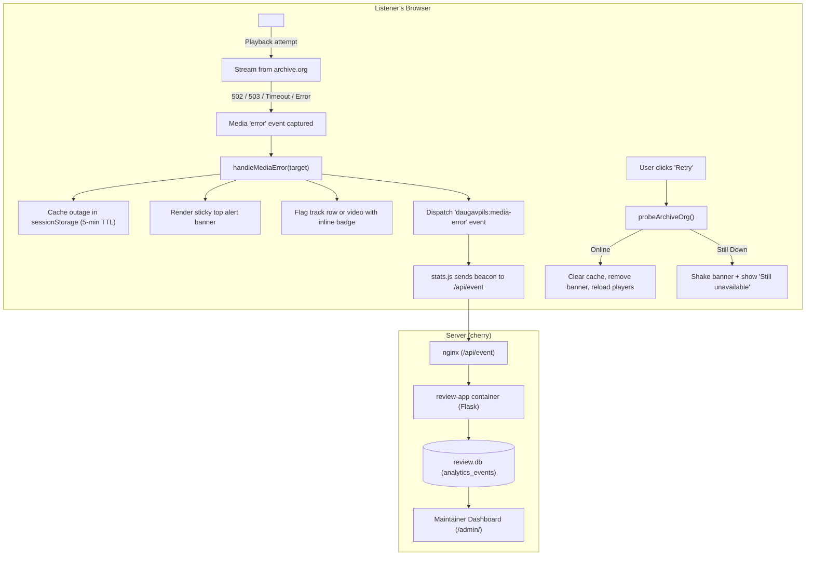

# Internet Archive (`archive.org`) Outage Detection & Notification

All audio and video media files for the Daugavpils Music Archive (`daugavpils.fans`) stream directly from Internet Archive servers (`https://archive.org/download/...`). When Internet Archive suffers global maintenance, downtime, or CDN degradation (HTTP 502 Bad Gateway, 503 Service Unavailable, or connection timeouts), audio and video playback silently fails in the visitor's browser.

Without an explicit notification system, listeners often assume their own browser, computer, or internet connection is broken (e.g., assuming audio drivers or Windows needs reinstallation).

This feature detects Internet Archive outages in real time on the client side, presents clear bilingual notifications, enables manual re-checks via a "Retry" button, and logs telemetry events to the `/admin/` dashboard.

---

## 1. Architecture & Flow



---

## 2. Component Breakdown

### 2.1 Client-Side Detection (`webapp/static/player.js`)
- **Event capture**: Listens for the `error` event in the capture phase on `<audio>`, `<video>`, and `<source>` elements.
- **Source verification**: Only media URLs originating from `archive.org` trigger the outage handler.
- **Inline status**:
  - The failed track row receives the `.media-outage-row` CSS class and an inline warning badge:
    - Russian: `⚠️ сбой archive.org`
    - English: `⚠️ archive.org error`
  - Video lightboxes receive the `.media-outage-state` CSS class with an inline warning inside the `<figure>`.

### 2.2 Top Sticky Alert Banner (`#archive-outage-banner`)
- Rendered dynamically at the top of `document.body` as an accessible `<aside role="alert" aria-live="assertive">`.
- Styled with `position: sticky; top: 0; z-index: 1000;` using high-contrast colors matching the archive's dark palette (`#3b180d` background, `#ff922b` border and accents, `#ffd8a8` text).
- **Bilingual copy** determined by the page language (`<html lang="ru|en">`):
  - **Russian (`ru`)**:
    > ⚠️ **Сервера Internet Archive (archive.org) временно недоступны.** Воспроизведение аудио и видео сейчас может не работать из-за временного сбоя на стороне архива. Ваш компьютер и браузер в порядке.  
    > `[ Попробовать снова ]` `[ ✕ ]`
  - **English (`en`)**:
    > ⚠️ **Internet Archive (archive.org) servers are temporarily unavailable.** Audio and video playback may not work right now due to a temporary outage on archive.org. Your computer and browser are working properly.  
    > `[ Retry ]` `[ ✕ ]`
- **Actions**:
  - **Retry ("Попробовать снова" / "Retry")**:
    - Disables button and displays `"Проверка связи..."` / `"Checking..."`.
    - Probes `https://archive.org/services/img/internetarchive` with a 3-second timeout.
    - If archive.org is accessible: clears the cached outage, dismisses the banner, removes inline track warnings, and reloads media elements via `mediaEl.load()`.
    - If still down: shakes the banner with a CSS keyframe animation (`archive-outage-shake`), displays `"Сервера всё ещё недоступны"` / `"Servers are still unavailable"`, and restores the button after 1.5 seconds.
  - **Dismiss ("✕")**:
    - Hides the banner and sets `sessionStorage.setItem('daugavpils-fans:archive-outage-dismissed', '1')`.
    - If the user explicitly clicks play on another failed track, the dismissed flag is cleared and the banner reappears.

### 2.3 Session Persistence (`sessionStorage`)
- When an outage is detected, the status is cached in `sessionStorage` under `daugavpils-fans:archive-outage`:
  ```json
  { "down": true, "timestamp": 1789211000000 }
  ```
- **TTL**: 5 minutes (300,000 ms).
- On subsequent page navigations during the session, `DOMContentLoaded` checks the cache and automatically renders the banner so users immediately know archive.org remains unavailable without having to re-trigger a failed playback.

### 2.4 Telemetry & Maintainer Monitoring (`stats.js` & `analytics.py`)
- When a confirmed media error occurs, `player.js` emits a `daugavpils:media-error` custom event.
- `webapp/static/stats.js` listens to this event, deduplicates errors per media item, and transmits a `media_error` beacon to `/api/event`:
  ```json
  {
    "type": "media_error",
    "path": "/bands/glazki-stekolshika/chernovyaki/",
    "track": "05-ivanovo.mp3",
    "band": "glazki-stekolshika",
    "release": "chernovyaki"
  }
  ```
- `review_app/analytics.py` accepts and logs `media_error` events into SQLite table `analytics_events`.
- `review_app/admin.py` counts media errors in the active time filter (`Today`, `7d`, `30d`, `All Time`).
- The admin dashboard (`/admin/`) displays a dedicated summary card:
  - **Media Errors (archive.org)** with a warning accent color when errors exceed 0.

---

## 3. Build & Deployment Outage Resilience (`webapp/build.py`)

During static site generation (`webapp/build.py`), `require_media_published()` checks that all referenced media exists on archive.org before publishing. If Internet Archive is suffering an outage returning HTTP 502/503:
- The build script first performs a 3-second probe against `https://archive.org/metadata/daugavpils-fans-dvinsk`.
- If unreachable or returning a server error, the publication check is fast-skipped with a clear warning:
  ```
  WARNING: archive.org is unreachable (...); skipping media publication check
  ```
- If an individual item metadata call raises an error, `ArchiveOrgUnavailableError` aborts the remaining item checks immediately, preventing build timeouts or exponential backoff hangs.

---

## 4. Verification & Testing

- **Node.js client tests**:
  ```bash
  node --test webapp/test_player.mjs
  ```
  Validates banner rendering in Russian and English, track row error marking, session storage caching, and retry recovery.
- **Python backend tests**:
  ```bash
  ./.venv/bin/python -m unittest discover -s review_app -p 'test_*.py'
  ```
  Validates `media_error` analytics ingestion and admin dashboard rendering.
