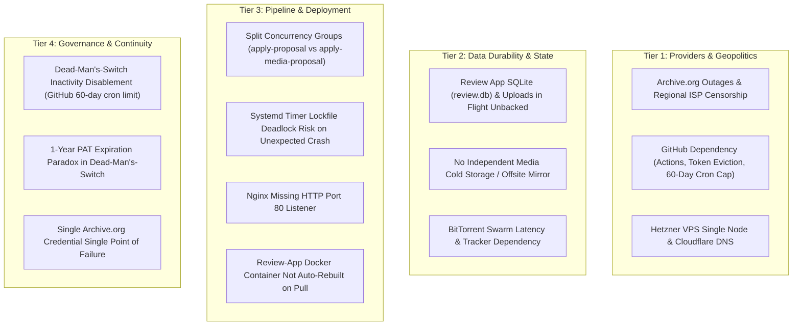
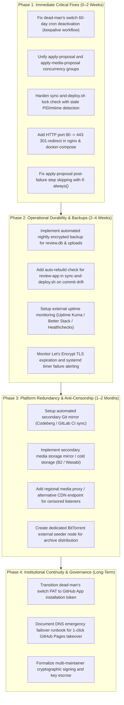

# Full System Resilience Audit: Daugavpils Music Archive

**Document status**: Current  
**Audit date**: September 2026  
**System audited**: Daugavpils Music Archive (`daugavpils.fans`, `review.daugavpils.fans`, GitHub Pages mirror, GitHub Actions, Archive.org infrastructure)

---

## 1. Executive Summary & Resilience Scorecard

The **Daugavpils Music Archive** is built with an unusually thoughtful baseline architecture: it strictly decouples git-tracked metadata ([`bands/**/*.yaml`](file:///Users/sergei/code/daugavpils.fans/bands)) from immutable media storage on the Internet Archive ([`archive.org`](https://archive.org)), verifies byte-level integrity with SHA-256 checksums, and operates a zero-downtime GitHub Pages static mirror alongside its primary Hetzner VPS host.

However, a comprehensive resilience and threat-model audit reveals critical operational and catastrophic vulnerabilities across the four operational tiers:



### Resilience Scorecard

| Domain | Baseline Rating | Core Strength | Primary Critical Risk | Target Hardened Rating |
| :--- | :---: | :--- | :--- | :---: |
| **Archival Integrity & Durability** | **A-** | Full SHA-256 verification, metadata consolidated bundle on archive.org | No secondary media replica; uploads in flight sit on ephemeral VPS disk | **A+** |
| **Platform Redundancy & Access** | **B+** | Dual Site Build (Hetzner VPS + GitHub Pages mirror) | Single DNS provider, no automated failover; archive.org geo-blocked in Russia | **A** |
| **Deployment & CI Pipelines** | **B** | Atomic worktree symlink swapping, 15-min sweep cron | Split concurrency groups race commits; locked deploy script lacks stale-PID check | **A** |
| **Operational Durability (VPS State)** | **C-** | Static site generation shields live browsing from DB failure | `review.db` and `/uploads` unbacked; total data loss on Hetzner VPS disk failure | **A-** |
| **Observability & Silent Failure** | **D+** | Nightly metadata drift audit, client-side outage banner | No external heartbeat ping, certbot failure unmonitored, silent systemd failures | **A** |
| **Governance & "Bus Factor"** | **B-** | Documented dead-man's switch with trusted contacts | GitHub 60-day cron deactivation freezes switch; fine-grained PAT expiration | **A** |

---

## 2. Threat Model & Failure Domain Breakdown

The audit systematically assesses the project across two parallel mandates:
1. **Live Operational Robustness**: Protecting the availability, security, and integrity of the live website (`daugavpils.fans`), proposal submission app (`review.daugavpils.fans`), and deployment pipelines.
2. **Long-Term Archival Survival**: Guaranteeing that recordings, artwork, video testimonies, and cultural metadata survive permanently even if the current maintainer disappears, the domain expires, or GitHub/archive.org face severe disruptions.

---

### Tier 1: Third-Party Infrastructure, Platform & Geopolitical Failures

#### 1.1 Internet Archive (`archive.org`) Outages, Degradation & DDoS
- **Current State**: Audio, video, and photos stream directly from `https://archive.org/download/...`. Outages trigger a client-side alert banner ([`webapp/static/player.js`](file:///Users/sergei/code/daugavpils.fans/webapp/static/player.js#L161-L325)) and log beacons to `/api/event` ([`documentation/ARCHIVE_ORG_OUTAGES.md`](file:///Users/sergei/code/daugavpils.fans/documentation/ARCHIVE_ORG_OUTAGES.md)). Static site generation probes archive.org and skips validation if down.
- **Vulnerability**: 
  - If archive.org is down, the website still loads, but media playback is completely non-functional.
  - Archive.org has suffered prolonged outages (e.g. multi-week read-only states following DDoS attacks and library breaches).
  - Torrents generated by archive.org rely on archive.org's web seed (`https://archive.org/download/...`) and archive.org trackers. When archive.org is down, torrent peer discovery and initial piece seeding degrade significantly.
- **Risk Level**: **HIGH**

#### 1.2 Geopolitical & Regional Censorship (ISP Blocking)
- **Current State**: Media streaming originates from `archive.org`.
- **Vulnerability**:
  - The Daugavpils music scene has a large Russian-speaking audience and diaspora. Internet Archive (`archive.org`) is periodically blocked or throttled by Roskomnadzor within the Russian Federation and Belarus.
  - Listeners in those regions can browse the static HTML on `daugavpils.fans` but audio/video streaming fails silently or throws timeouts, presenting false impressions of broken players.
- **Risk Level**: **MEDIUM-HIGH**

#### 1.3 GitHub Platform Outage, Ban, or DMCA Takedown
- **Current State**: Metadata and code reside at [`svalevka/daugavpils.fans`](https://github.com/svalevka/daugavpils.fans). The mirror is hosted on GitHub Pages ([`.github/workflows/pages.yml`](file:///Users/sergei/code/daugavpils.fans/.github/workflows/pages.yml)).
- **Vulnerability**:
  - The metadata is backed up to archive.org ([`daugavpils-fans-metadata`](file:///Users/sergei/code/daugavpils.fans/tools/publish_to_archive_org.py#L228-L260)), but the source code, Jinja2 templates, tools, and CI workflows exist only in git clones and GitHub.
  - There is no automated secondary git mirror (e.g. Codeberg, GitLab, or self-hosted cgit/Forgejo). A GitHub account suspension or repository takedown blocks all CI/CD, proposals, dead-man's-switch execution, and mirror hosting.
- **Risk Level**: **MEDIUM**

#### 1.4 Single Cloud Provider (Hetzner VPS `cherry`) & DNS Dependency
- **Current State**: Primary site and `review_app` run on a single Hetzner VPS (`cherry`). DNS is hosted on Cloudflare pointing A records to Hetzner's IP.
- **Vulnerability**:
  - If Hetzner datacenter fails, hardware burns, or the server is terminated, `daugavpils.fans` goes offline.
  - Failover to GitHub Pages is **manual**: a human must log into Cloudflare DNS and reconfigure records to point to `svalevka.github.io` (or set up a CNAME and custom domain on GitHub Pages).
  - No automated health check or DNS failover is currently configured.
- **Risk Level**: **MEDIUM**

---

### Tier 2: Data Durability, Ephemeral State & Disaster Recovery

#### 2.1 Review App SQLite Database (`review.db`) Durability
- **Current State**: [`docs/adr/0003-public-proposal-app-live-server.md`](file:///Users/sergei/code/daugavpils.fans/docs/adr/0003-public-proposal-app-live-server.md) accepted that `review.db` is ephemeral and not backed up.
- **Vulnerability**:
  - Since ADR-0003, `review.db` has accumulated significant state:
    1. Pending text proposals.
    2. Pending media proposals.
    3. The authorized approvers list.
    4. **All privacy-preserving listener analytics** (`analytics_events` table: track plays, visitor counts, path views, media error logs).
  - If the VPS filesystem is corrupted or recreated, all analytics history is permanently lost.
- **Risk Level**: **MEDIUM**

#### 2.2 Uploaded Media in Flight (`review-app-data/uploads/`)
- **Current State**: When a contributor uploads a band photo or live concert video via `review.daugavpils.fans/submit`, the raw file is saved to `/data/uploads/` ([`review_app/media_submissions.py`](file:///Users/sergei/code/daugavpils.fans/review_app/media_submissions.py#L127-L139)). It sits on disk until a curator reviews it, approves it, and dispatches `apply-media-proposal.yml`.
- **Vulnerability**:
  - If the VPS disk fails while an upload is awaiting review (or before the maintainer/Action publishes it to archive.org), the user's submitted original recording or photo is lost forever.
  - There is no offsite staging or secondary replication for media in flight.
- **Risk Level**: **HIGH**

#### 2.3 Absence of Secondary Offsite Media Replica (Cold Storage)
- **Current State**: Pristine media files are kept locally by the maintainer and uploaded to `archive.org`. Anyone can run [`tools/download_archive.py`](file:///Users/sergei/code/daugavpils.fans/tools/download_archive.py) to create a verified local clone.
- **Vulnerability**:
  - The project has no formal off-site cold storage or decentralized preservation mirror (such as a Backblaze B2 bucket, Wasabi, or an encrypted rsync target).
  - If the maintainer's local machine is destroyed and archive.org suffers catastrophic data corruption, there is no third independent repository of media bytes.
- **Risk Level**: **MEDIUM-HIGH**

---

### Tier 3: Deployment, CI/CD Pipelines & Automation Edge Cases

#### 3.1 Split Concurrency Groups Racing Git Commits
- **Current State**:
  - `apply-proposal.yml` specifies:
    ```yaml
    concurrency:
      group: apply-proposal
      cancel-in-progress: false
    ```
  - `apply-media-proposal.yml` specifies:
    ```yaml
    concurrency:
      group: apply-media-proposal
      cancel-in-progress: false
    ```
- **Vulnerability**:
  - A text proposal approval and a media proposal approval can run **simultaneously** in GitHub Actions.
  - Both check out `main`, modify YAML files under `bands/`, and attempt to push.
  - While both have retry loops (`git fetch origin main && git rebase`), if both modify the same file (e.g. `band.yaml`, one adding a description edit, the other adding an `image` entry), `git rebase` will encounter a merge conflict.
  - Non-interactive git rebase fails on conflict, causing the Action to exit with an error.
- **Risk Level**: **HIGH**

#### 3.2 Post-Failure Cascade in `apply-proposal.yml`
- **Current State**:
  In [`.github/workflows/apply-proposal.yml`](file:///Users/sergei/code/daugavpils.fans/.github/workflows/apply-proposal.yml#L169-L189):
  ```bash
  exit $overall_failed
  ```
  Followed by:
  ```yaml
  - name: Trigger Pages mirror rebuild
    if: steps.targets.outputs.ids != ''
    run: gh workflow run pages.yml --ref main
  - name: Trigger metadata sync to archive.org
    if: steps.targets.outputs.ids != ''
    run: gh workflow run sync-metadata.yml --ref main
  ```
- **Vulnerability**:
  - If a sweep contains multiple proposals and one fails, `overall_failed=1` causes the job to terminate immediately at line 169.
  - The subsequent steps (`Trigger Pages mirror rebuild` and `Trigger metadata sync to archive.org`) are skipped because they lack `if: always()`.
  - Proposals that *were* successfully committed and pushed earlier in that same sweep will **not** trigger a Pages mirror build or metadata sync to archive.org.
- **Risk Level**: **MEDIUM**

#### 3.3 Permanent Lock Deadlock in `sync-and-deploy.sh`
- **Current State**:
  In [`webapp/deploy/sync-and-deploy.sh`](file:///Users/sergei/code/daugavpils.fans/webapp/deploy/sync-and-deploy.sh#L77-L84):
  ```bash
  LOCK_DIR="${LOCK_DIR:-/opt/daugavpils-fans/.sync-and-deploy.lock.d}"
  if ! mkdir "$LOCK_DIR" 2>/dev/null; then
    echo "another run is already in progress ($LOCK_DIR exists) - exiting"
    exit 0
  fi
  trap 'rmdir "$LOCK_DIR" 2>/dev/null || true' EXIT
  ```
- **Vulnerability**:
  - `mkdir` is atomic, but if the VPS reboots abruptly, the host kernel crashes, or OOM killer terminates the process (`SIGKILL`), the `EXIT` trap never executes.
  - `$LOCK_DIR` remains on disk indefinitely.
  - Every subsequent run of `sync-and-deploy.sh` (every 5 minutes via systemd timer) detects the directory and immediately exits.
  - **The server silently stops deploying all updates forever** until an operator notices and manually removes the stale lock directory.
- **Risk Level**: **HIGH**

#### 3.4 Review-App Container Not Rebuilt on Push
- **Current State**:
  [`docker-compose.yml`](file:///Users/sergei/code/daugavpils.fans/webapp/deploy/docker-compose.yml#L20-L32) builds `review-app` with context `./site/current-checkout`. `sync-and-deploy.sh` updates the `current-checkout` symlink and rebuilds the static HTML, but **never rebuilds or restarts the `review-app` container**.
- **Vulnerability**:
  - If a commit fixes a security bug or adds functionality in `review_app/`, `sync-and-deploy.sh` deploys the new static site, but the live `review_app` process continues running the old Docker image.
  - The maintainer must remember to manually SSH into `cherry` and execute `docker compose build review-app && docker compose up -d review-app`.
- **Risk Level**: **MEDIUM**

#### 3.5 Nginx Missing Port 80 Listener (Plain HTTP Connection Refused)
- **Current State**:
  In [`webapp/deploy/nginx/daugavpils.conf`](file:///Users/sergei/code/daugavpils.fans/webapp/deploy/nginx/daugavpils.conf#L1-L20):
  ```nginx
  server {
      listen 443 ssl;
      listen [::]:443 ssl;
      server_name daugavpils.fans www.daugavpils.fans;
      ...
  }
  ```
- **Vulnerability**:
  - Port 80 is not listened on. If a visitor types `http://daugavpils.fans` into a browser without HSTS preload or automatic HTTPS upgrade, the connection is refused.
  - Any external link or aggregator using plain `http://` fails completely.
- **Risk Level**: **MEDIUM**

---

### Tier 4: Governance, Maintainer Continuity & "Bus Factor"

#### 4.1 GitHub Actions 60-Day Cron Inactivity Disablement
- **Current State**:
  [`documentation/DEAD_MANS_SWITCH.md`](file:///Users/sergei/code/daugavpils.fans/documentation/DEAD_MANS_SWITCH.md) relies on `.github/workflows/switch-check.yml`, which runs daily on a cron trigger (`cron: "17 3 * * *"`).
- **Vulnerability**:
  - **GitHub's platform policy automatically disables scheduled (cron) workflows in public repositories after 60 days of commit inactivity**.
  - If the maintainer disappears or is incapacitated, and no new commits land for 60 days, GitHub **silently disables** `switch-check.yml`.
  - When a trusted contact subsequently discovers the maintainer is gone and opens a dead-man's switch issue, `switch-request.yml` fires and labels the issue `switch-pending`.
  - **However, `switch-check.yml` will never execute to trip the switch!**
  - Because external trusted contacts lack collaborator permissions, they cannot trigger `switch-check.yml` via `workflow_dispatch`.
  - The dead-man's switch is rendered completely dormant and inoperable.
- **Risk Level**: **CRITICAL**

#### 4.2 Fine-Grained PAT 1-Year Expiration Paradox
- **Current State**:
  `switch-check.yml` uses `SWITCH_VAULT_PAT` to invite the requester to `svalevka/daugavpils-fans-recovery-vault`. Fine-grained PATs expire after at most 1 year.
- **Vulnerability**:
  - `switch-selftest.yml` warns when the PAT expires and tags trusted contacts after 3 failures.
  - However, **only the owner of the repo can mint and update `SWITCH_VAULT_PAT` in GitHub secrets**.
  - If the maintainer has already disappeared when the PAT expires, the trusted contacts are notified that the switch is broken, but they have zero administrative ability to fix it.
- **Risk Level**: **HIGH**

#### 4.3 Single Archive.org Publishing Credential
- **Current State**:
  All uploads use screenname `daugavpils.fans` ([`CLAUDE.md`](file:///Users/sergei/code/daugavpils.fans/CLAUDE.md#L93-L96)). If the credential is lost, `documentation/RECOVERY.md` requires registering a new account and modifying `ITEM_PREFIX`.
- **Vulnerability**:
  - If the archive.org account is banned, locked, or credentials compromised, nobody can modify existing items.
  - Recovery requires an entire re-upload of the full archive under a new namespace.
- **Risk Level**: **MEDIUM**

---

## 3. Failure Mode & Effects Analysis (FMEA) Matrix

| ID | Failure Mode | Cause | Impact | Likelihood | Severity | Detectability | Current Mitigation |
| :--- | :--- | :--- | :--- | :---: | :---: | :---: | :--- |
| **F-01** | Dead-man's switch fails to trip | GitHub disables scheduled cron after 60 days of inactivity | **Catastrophic** | High | **CRITICAL** | Poor (Silent) | None |
| **F-02** | Stale lock stalls VPS deploys | Host reboot or OOM kills `sync-and-deploy.sh` | **High** | Med | **HIGH** | Poor (Silent) | Trap only (fails on SIGKILL/reboot) |
| **F-03** | Loss of submitted media in flight | VPS disk failure before curator approves & uploads | **High** | Low | **HIGH** | Moderate | None (stored only on VPS `/data/uploads`) |
| **F-04** | Git conflict between proposals | Concurrent execution of `apply-proposal` & `apply-media` | **Med-High** | Med | **HIGH** | High (CI logs) | Git rebase loop (fails on merge conflict) |
| **F-05** | Loss of historical listener analytics | VPS disk corruption (`review.db`) | **Medium** | Low | **MEDIUM** | Low | None (ADR-0003: no backups) |
| **F-06** | Plain HTTP connection refused | Nginx missing port 80 listener | **Medium** | High | **MEDIUM** | Immediate | HSTS header on HTTPS only |
| **F-07** | Media streaming failure in censored regions | ISP blocks against `archive.org` in RU/BY | **Medium** | High | **MEDIUM** | Moderate | Outage banner (client-side only) |
| **F-08** | Missed Pages mirror / metadata sync | Sweep proposal failure stops subsequent steps | **Medium** | Low | **MEDIUM** | High | None (`exit 1` aborts workflow) |
| **F-09** | Outdated review-app container | Code changed in git but container not rebuilt | **Medium** | Med | **MEDIUM** | Poor | Manual rebuild required |
| **F-10** | Expired PAT breaks vault delivery | Fine-grained PAT reaches 1-year max lifetime | **High** | Med | **HIGH** | High | `switch-selftest.yml` monthly check |

---

## 4. Deep-Dive Vulnerability & Gap Analysis

### 4.1 The Dead-Man's Switch Inactivity Bug ([`switch-check.yml`](file:///Users/sergei/code/daugavpils.fans/.github/workflows/switch-check.yml))

#### Mechanism
GitHub Actions documentation states:
> *"Scheduled workflows will be disabled automatically if there has been no repository activity in 60 days."*

If the maintainer dies or is incapacitated:
1. Day 1–60: Repository receives no commits.
2. Day 61: GitHub disables all workflows with an `on: schedule` block, including `switch-check.yml` and `switch-selftest.yml`.
3. Day 90: A trusted contact realizes the maintainer is missing and opens an issue titled *"Dead-man's-switch: request archive.org access"*.
4. `switch-request.yml` runs because it is triggered by `on: issues: [opened]`. It labels the issue `switch-pending` and mentions everyone.
5. However, `switch-check.yml` **never runs** because its daily cron is disabled!
6. The issue sits in `switch-pending` indefinitely.
7. External trusted contacts cannot click "Run workflow" because `workflow_dispatch` requires write access to the repo.

#### Remediation
- **Keep-alive workflow**: Add a lightweight scheduled workflow (e.g. `keepalive.yml` running once a month) that creates an automated trivial commit or dummy release, or uses a GitHub Keepalive action (`gautamkrishnar/keepalive-workflow`) to prevent cron deactivation.
- **Event-driven check**: In addition to cron, allow `switch-check.yml` to trigger on `issues: [opened, labeled]`. While the 7-day delay cannot elapse on day 0, any subsequent comment or activity on the issue can re-evaluate the age check.

---

### 4.2 Split CI/CD Concurrency Groups

#### Mechanism
In `.github/workflows/`:
- `apply-proposal.yml`: `concurrency: group: apply-proposal`
- `apply-media-proposal.yml`: `concurrency: group: apply-media-proposal`

Because the concurrency groups have different names, GitHub Actions runs them concurrently. If an approver processes both a text correction and a photo upload on `review.daugavpils.fans/dashboard` within minutes of each other:
1. Both Actions checkout `origin/main` at commit `X`.
2. `apply-proposal.yml` edits `bands/m-spirit/band.yaml` (modifies bio).
3. `apply-media-proposal.yml` edits `bands/m-spirit/band.yaml` (appends to `image` list).
4. `apply-proposal.yml` commits and pushes first (commit `Y`).
5. `apply-media-proposal.yml` tries to push, gets rejected, and runs:
   ```bash
   git fetch origin main
   git rebase origin/main
   ```
6. Git rebase attempts to replay the media patch on top of commit `Y`. Because both commits touched adjacent or overlapping sections of `band.yaml`, git fails with a conflict.
7. The rebase fails, the Action crashes, and the media proposal remains unapplied.

#### Remediation
Unify the concurrency group across both workflows:
```yaml
concurrency:
  group: apply-archive-mutations
  cancel-in-progress: false
```
This guarantees that all write operations to `main` queue sequentially.

---

### 4.3 Stale Lock Deadlock in `sync-and-deploy.sh`

#### Mechanism
[`webapp/deploy/sync-and-deploy.sh`](file:///Users/sergei/code/daugavpils.fans/webapp/deploy/sync-and-deploy.sh#L77-L84):
```bash
if ! mkdir "$LOCK_DIR" 2>/dev/null; then
  echo "another run is already in progress ($LOCK_DIR exists) - exiting"
  exit 0
fi
trap 'rmdir "$LOCK_DIR" 2>/dev/null || true' EXIT
```
If the host experiences a power cycle, reboot, or OOM kill:
- The bash process terminates without running the EXIT trap.
- `$LOCK_DIR` remains on the filesystem.
- Future invocations see `$LOCK_DIR` and exit with code 0.
- Systemd marks the timer invocation successful; no error is logged.
- The server is permanently stuck on the old commit.

#### Remediation
Enhance lock management with PID and age validation:
```bash
LOCK_FILE="$LOCK_DIR/pid"
if ! mkdir "$LOCK_DIR" 2>/dev/null; then
  if [ -f "$LOCK_FILE" ]; then
    LOCK_PID="$(cat "$LOCK_FILE" 2>/dev/null || true)"
    if [ -n "$LOCK_PID" ] && ! kill -0 "$LOCK_PID" 2>/dev/null; then
      echo "Stale lock from dead PID $LOCK_PID detected; reclaiming lock"
      rm -rf "$LOCK_DIR"
      mkdir "$LOCK_DIR"
    else
      echo "Another run is in progress (PID $LOCK_PID) - exiting"
      exit 0
    fi
  else
    # Lock dir exists without PID, check mtime older than 15 minutes
    if [ $(( $(date +%s) - $(stat -c %Y "$LOCK_DIR" 2>/dev/null || stat -f %m "$LOCK_DIR") )) -gt 900 ]; then
      echo "Stale lock directory older than 15 min detected; reclaiming"
      rm -rf "$LOCK_DIR"
      mkdir "$LOCK_DIR"
    else
      exit 0
    fi
  fi
fi
echo $$ > "$LOCK_DIR/pid"
trap 'rm -rf "$LOCK_DIR" 2>/dev/null || true' EXIT
```

---

### 4.4 Missing HTTP Port 80 Listener in Nginx

#### Mechanism
[`webapp/deploy/nginx/daugavpils.conf`](file:///Users/sergei/code/daugavpils.fans/webapp/deploy/nginx/daugavpils.conf) listens exclusively on `443 ssl`.
- If a user enters `daugavpils.fans` in an environment that does not default to HTTPS, the OS attempts TCP port 80 and receives `ECONNREFUSED`.
- ACME HTTP-01 challenges cannot work (the project uses DNS-01 via Cloudflare, but having port 80 redirect is standard web resilience).

#### Remediation
Add a standard port 80 redirect block:
```nginx
server {
    listen 80;
    listen [::]:80;
    server_name daugavpils.fans www.daugavpils.fans review.daugavpils.fans;

    location /.well-known/acme-challenge/ {
        root /var/www/certbot;
    }

    location / {
        return 301 https://$host$request_uri;
    }
}
```
And expose port 80 in [`docker-compose.yml`](file:///Users/sergei/code/daugavpils.fans/webapp/deploy/docker-compose.yml#L7).

---

### 4.5 Unbacked Live State on `cherry` (`review.db` & `/uploads`)

#### Mechanism
ADR-0003 deliberately chose not to back up `review-app-data`. However:
1. Contributors uploading rare audio/photos/videos to `review.daugavpils.fans/submit` store the only digital copy on `cherry` at `/data/uploads/` until curated.
2. The analytics engine stores all visitor and media metrics in SQLite.
3. If the VPS instance is compromised, crashed, or lost, this data disappears.

#### Remediation (Implemented via Option A: Zero-Credential Pull Architecture)
Implemented via `GET /api/backup` in `review_app/api.py` and `.github/workflows/backup-to-b2.yml`:
- Nightly GitHub Actions workflow connects over HTTPS to `https://review.daugavpils.fans/api/backup` using `REVIEW_APP_CALLBACK_KEY`.
- `review_app` creates an atomic SQLite online backup of `review.db` (`sqlite3.backup`) and bundles `/data/uploads/` into an in-memory/temp `.tar.gz`.
- The GitHub Action streams the archive and uploads it directly to Backblaze B2 (`daugavpils.fans`), pruning archives older than 14 days.
- **Zero cloud storage credentials on `cherry`**: Backblaze B2 keys (`B2_APPLICATION_KEY_ID`, `B2_APPLICATION_KEY`) reside exclusively in encrypted GitHub Repository Secrets. If the VPS is compromised, the attacker has zero access to backups or the Backblaze account.

---

## 5. Prioritized Remediation Roadmap



### Phase 1: Immediate Critical Fixes (Week 1–2)

1. **Dead-Man's-Switch Keepalive**:
   - Create `.github/workflows/keepalive.yml` that commits a trivial timestamp to a dedicated branch or runs every 30 days to guarantee GitHub Actions scheduled cron jobs are never suspended.
   - Add `issues: [opened, labeled]` trigger to `switch-check.yml` to ensure activity on a switch issue triggers an immediate evaluation.
2. **Unified Action Concurrency**:
   - Update `apply-proposal.yml` and `apply-media-proposal.yml` to share `concurrency: group: apply-archive-mutations`.
3. **Robust Lock Acquisition in `sync-and-deploy.sh`**:
   - Replace simple `mkdir` with PID file verification and 15-minute expiration check.
4. **Nginx HTTP 80 Listener**:
   - Add port 80 redirect block to `nginx/daugavpils.conf` and open port `"80:80"` in `docker-compose.yml`.
5. **Workflow Step Execution**:
   - Add `if: always() && steps.targets.outputs.ids != ''` to Pages rebuild and metadata sync steps in `apply-proposal.yml`.

### Phase 2: Operational Durability & Monitoring (Week 3–4)

1. **Review App Backup Script**:
   - Deploy `backup-vps-data.sh` on `cherry` to snapshot SQLite via `.backup` and tar `/uploads`.
2. **Review App Container Auto-Update**:
   - In `sync-and-deploy.sh`, check if `review_app/` or `review_app/Dockerfile` changed between `$(cat $STATE_FILE)` and `$LATEST_SHA`. If so, trigger `docker compose build review-app && docker compose up -d review-app`.
3. **External Monitoring & Heartbeats**:
   - Deploy ping monitoring (Healthchecks.io or Uptime Kuma) for:
     - `https://daugavpils.fans`
     - `https://review.daugavpils.fans`
     - GitHub Pages mirror
     - Heartbeat curl inside `sync-and-deploy.sh` on successful deployment.
     - Certbot renewal timer monitoring.

### Phase 3: Platform Redundancy & Anti-Censorship (Month 2)

1. **Secondary Git Mirror**:
   - Configure a GitHub Action on push to mirror `main` to Codeberg or GitLab.
2. **Secondary Media Replication (Cold Storage)**:
   - Establish an automated script or B2 bucket holding SHA-256 verified copies of audio/video archives, independent of archive.org.
3. **Regional Media Fallback / Proxy**:
   - Evaluate Cloudflare Workers or server-side media proxy for users unable to connect to `archive.org/download/...` due to state ISP blocks.
4. **Active BitTorrent Seeder**:
   - Spin up a low-cost seeding client (transmission/libtorrent) on a secondary VPS to actively seed all `_archive.torrent` swarms, ensuring independence from archive.org's web seed.

### Phase 4: Institutional Continuity & Governance (Long-Term)

1. **Eliminate PAT Expiry in Dead-Man's Switch**:
   - Replace personal access tokens (`SWITCH_VAULT_PAT`) with a custom GitHub App installed on the vault repository. GitHub Apps use asymmetric key pairs and never expire like personal access tokens.
2. **Documented 1-Click DNS Failover**:
   - Add an emergency Cloudflare Worker or DNS switch guide in [`documentation/RECOVERY.md`](file:///Users/sergei/code/daugavpils.fans/documentation/RECOVERY.md) showing exactly how to redirect `daugavpils.fans` traffic directly to GitHub Pages if Hetzner is permanently lost.

---

## 6. Verification & Audit Testing Checklist

To maintain confidence in system resilience, run these checks periodically:

- [ ] **Simulated Outage**: Verify banner behavior using `node --test webapp/test_player.mjs`.
- [ ] **Switch Selftest**: Trigger `.github/workflows/switch-selftest.yml` manually to confirm trusted contacts JSON and vault PAT validity.
- [ ] **Metadata Audit**: Check nightly run of `.github/workflows/verify-archive-org.yml` for drift between git and archive.org.
- [ ] **Deploy Script Test**: Run `python3 -m unittest webapp/deploy/test_sync_and_deploy.py`.
- [ ] **Full Integration Suite**: Run all 254 test cases across `tools/`, `webapp/`, `webapp/deploy/`, and `review_app/`.
- [ ] **Backup Verification**: Perform a test restoration of `review.db` and uploaded media from backup snapshots into a fresh staging container.
